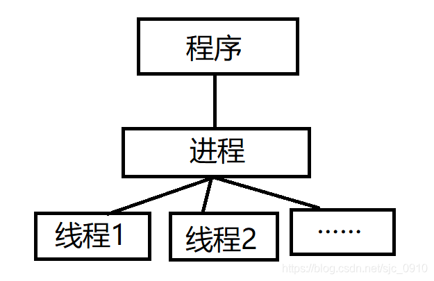

# SLAM笔记

## Linux系统操作

### 系统命令行

* `sudo apt-get install xxx`：安装xxx
* `sudo apt-get remove xxx`：卸载xxx（apt在线安装卸载）
* `sudo dpkg -i xxx`：安装xxx（deb文件格式）
* `sudo dpkg -r xxx `：卸载xxx（deb文件格式卸载）
* `cd home`：切换到home目录
* `cd ..`：切换到上级目录
* `touch xxx.cpp`：创建一个cpp文件
* `mkdir xxx/`：创建文件夹
* ` rmdir xxx/`：删除文件夹
* `sudo rm -r xxx`：删除文件夹
* `dir`：查看有哪些文件
* `pwd`：显示当前文件的绝对路径
* `cat 文件名`：查看文件内容
* `vi`：修改文件
* `./xxx.sh`：运行xxx应用程序（脚本文件一般在bin文件夹里）
* `cp -r A B`：将文件夹A复制到文件夹B内


### vim操作

* `:wq`：保存退出
* `:q!`：不保存退出
* `dd`：删除所在行
* `i`：插入字符


### 升级Linux内核

* 查看当前内核信息：`uname -a`
* 查看可安装的内核：`apt-cache  search linux|grep linux-image`
* 下载对应的内核版本：`sudo apt install linux-image-5.8.14-amd64 linux-headers-5.8.14-amd64 `（还可以去网站https://kernel.ubuntu.com/~kernel-ppa/mainline/下载）
* 更新grub：`sudo update-grub`
* 查看启动顺序：开启启动延时，在grub菜单项内有主菜单和子菜单，顺序从0开始
* 修改启动顺序：`sudo nano /etc/default/grub`，修改`GRUB_DEFAULT`的值，格式为`"主菜单序号> 子菜单序号"`来选定想要启动的内核版本
* 更新grub：`sudo update-grub`


### 卸载多余的Linux内核

* 查看系统内核版本：`dpkg --get-selections| grep linux`

* 卸载内核软件包：`sudo apt-get remove --purge xxx`


### 有关编程的命令行

* `g++ xxx.cpp`：**编译**一个.cpp文件
* `./xxx.xxx`：**执行**编译好的xxx文件
* `cmake .`：调用cmake对所在目录工程进行cmake编译（多加一个就对上一层目录的文件进行编译）
* `make`：用make命令对工程进行编译，生成可执行程序


## **git仓库操作**

* `git init`：初始化仓库*
* `git add`：添加一个文件到暂存区（index）
* `git add .`：将修改加入暂存区*
* `git commit -m " "`：把文件从暂存区推送到仓库（repository）,并添加注释*
* `git rm`：删除文件
* `git status`：查看仓库信息
* `git log`：查看仓库记录
* `git log --pretty=oneline`：简化记录信息
* `git reset --hard 时间线`：回到某个版本
* `git reflog`：查看仓库详细记录
* `git branch`：查看分支
* `git branch 分支名`：添加分支
* `git checkout 分支名`：切换分支（`git checkout -b 分支名`：创建并切换）
* `git branch origin -M 分支名`：更换分支名*
* `git merge`：合并分支
* `git branch -d  分支名`：删除其他分支（-D为强制删除）
* `git remote add origin 仓库地址`：关联远程仓库*
* `git pull origin 分支名`：将代码更新和远程仓库一致*
* `git pull origin main --allow-unrelated-histories `：上一条被拒绝时使用*
* `git push origin main`：推送文件到远程仓库（不用带sudo，第一次在push后面加上-u）*
* `git clone 仓库的HTTPS`：克隆某个仓库的所有内容（不用带sudo）*
* `git clone -b 分支名+仓库地址`：下载指定分支
* `git rm 文件名`：删除单个文件（`git rm * -r`删除全部文件）
* `ssh-keygen -t rsa -C 邮箱地址`：获取SSH


### 使用git流程
* 在github中创建一个新的仓库
* 在需要上传文件的文件夹中初始化仓库，选择Git Bash Here
* `git init`
* 上传文件*
  * 上传某个文件：`git add "文件名"`
  * 上传全部文件：`git add .`
* `git config --global user.email "you@example.com"
   git config --global user.name "Your Name"`设置个人账号
* `ssh-keygen -t rsa -C "你的Git邮箱"`生成SSH秘钥
* `cat ~/.ssh/id_rsa.pub`查看生成公钥
* 复制全部内容到github的SSHkey上
* `git commit -m "注释"`*
* `git branch -M main`
* `git remote add origin git@github.com:用户名/仓库名`
   * `git remote rm origin`解除关联
* `git pull origin 分支名`：将代码更新和远程仓库一致*
   * 如果报错为fatal:拒绝合并无关的历史，则输入`git pull --allow-unrelated-histories origin main`
* `git push -u origin main` （第一次提交）
* `git push origin main`  （以后提交）*
* `git remote rm origin`移除远程仓库

注：带*为重复使用流程


## C++中的工厂模式

### 简单工厂模式

#### 定义

* 简单工厂模式（Simple Factory Pattern）专门定义**一个类（工厂）来负责创建其他类的实例（具体产品角色），被创建的实例通常具有共同的父类（抽象产品角色）。**


#### 模式结构

1. Factory工厂角色（工厂类）：

工厂角色即工厂类，是简单工厂模式的核心，负责创建所有实例的内部逻辑，工厂类可以被外界直接调用，创建所需要的产品对象。

2. Product（抽象产品类）：

抽象产品角色是简单工厂模式所创建的所有对象的父类，负责描述所有实例所共有的公告接口。所创建的具体产品对象都是其子类对象。

3. ConcreteProduct（具体产品类）：

具体产品角色是简单工厂模式的创建目标。每个具体产品角色都继承了抽象产品角色，需要实现定义在抽象产品中的方法。

ProductA、ProductB和ProductC继承自Product虚拟类，Show方法是不同产品的自描述；Factory依赖于ProductA、ProductB和ProductC，Factory根据不同的条件创建不同的Product对象


#### 结构图


其中Factory为工厂类，Product为抽象产品角色，ProductA、ProductB等为具体产品角色


#### 优缺点

* 优点：

  本着高内聚低耦合的原则，将系统的逻辑部分和功能分开。

* 缺点：

  简单工厂模式会增加系统类的个数，在一定程度上增加了系统的复杂度和理解难度；
  系统扩展难，一旦增加新产品，就需要修改工厂逻辑，不利于系统的扩展与维护；简单工厂模式中**所有产品的创建都是由同一个工厂创建，工厂类职责较重，业务逻辑较为复杂，具体产品与工厂类之间耦合度高，严重影响了系统的灵活性和扩展性。**


### 工厂方法模式

#### 定义

* 在工厂模式中，工厂父类负责定义创建产品对象的公告接口，而工厂子类负责生成具体的产品对象。**目的是将产品的实例化操作延迟到工厂子类中完成**，通过工厂子类来确定究竟应该实例化哪一个具体产品类。


#### 模式结构

1. Product（抽象产品类）

2. ConcreteProduct（具体产品类）

3. AbstractFactory（抽象工厂类）

4. Concrete（具体工厂类）

   具体工厂是抽象工厂类的子类，实现了抽象工厂中定义的工厂方法，并可由客户调用，返回一个具体产品类的实例。


#### 结构图


#### 优缺点

* 优点：

  系统的扩展性好，符合“开闭原则”  。系统加入新产品时，无须修改抽象工厂和抽象产品提供的接口，无须修改客户端，也无须修改其他的具体工厂和具体产品，而只要添加一个具体工厂和具体产品即可。

* 缺点：

  在添加新产品时，需要编写新的具体产品类，而且要提供与之对应的具体工厂类，系统中类的个数将成对增加，一定程度上增加了系统的复杂度。


### 抽象工厂模式

#### 定义

* 抽象工厂模式是工厂方法模式的泛化版，工厂模式是一种特殊的抽象工厂模式，**在工厂模式中，每个具体工厂只能生产一种具体的产品**，如海尔电视机厂只生产海尔电视机，而抽象工厂方法模式中，**一个具体的工厂可以生产多个具体产品**。

#### 模式结构

1. Product（抽象产品类）
2. ConcreteProduct（具体产品类）
3. AbstractFactory（抽象工厂类）
4. Concrete（具体工厂类）

#### 结构图


#### 优缺点

* 优点：
  1. 抽象工厂模式将产品族的依赖与约束关系放到抽象工厂中，便于管理。
  2. 职责解耦，用户不需要关心一堆自己不关心的细节，由抽象工厂来负责组件的创建
  3. 切换产品族容易，只需要增加一个具体工厂实现，客户端选择另一个套餐就可以了
* 缺点：
  1. 抽象工厂模式类增加的速度很快，有一个产品族就需要增加一个具体工厂实现，比较繁琐
  2. 产品族难以扩展产品。当产品族中增加一个产品时，抽象工厂接口中需要增加一个函数，对应的所有具体工厂实现都需要修改，修改放大严重。
  3. 抽象工厂并未完全屏蔽创建细节，给出的都是组件。对于这种情况可以结合工厂模式或简单工厂模式一起使用。


## CMake编译


参考：https://blog.csdn.net/qq_38410730/article/details/102477162?ops_request_misc=%257B%2522request%255Fid%2522%253A%2522167876427016800211563966%2522%252C%2522scm%2522%253A%252220140713.130102334..%2522%257D&request_id=167876427016800211563966&biz_id=0&utm_medium=distribute.pc_search_result.none-task-blog-2~all~top_positive~default-1-102477162-null-null.142


### 最常用的命令

```cmake
# 本CMakeLists.txt的project名称
# 会自动创建两个变量，PROJECT_SOURCE_DIR和PROJECT_NAME
# ${PROJECT_SOURCE_DIR}：本CMakeLists.txt所在的文件夹路径
# ${PROJECT_NAME}：本CMakeLists.txt的project名称
project(xxx)

# 获取路径下所有的.cpp/.c/.cc文件，并赋值给变量中
aux_source_directory(路径 变量)

# 给文件名/路径名或其他字符串起别名，用${变量}获取变量内容
set(变量 文件名/路径/...)

# 添加编译选项
add_definitions(编译选项)

# 打印消息
message(消息)

# 编译子文件夹的CMakeLists.txt
add_subdirectory(子文件夹名称)

# 将.cpp/.c/.cc文件生成.a静态库
# 注意，库文件名称通常为libxxx.so，在这里只要写xxx即可
add_library(库文件名称 STATIC 文件)

# 将.cpp/.c/.cc文件生成可执行文件
add_executable(可执行文件名称 文件)

# 规定.h头文件路径
include_directories(路径)

# 规定.so/.a库文件路径
link_directories(路径)

# 对add_library或add_executable生成的文件进行链接操作
# 注意，库文件名称通常为libxxx.so，在这里只要写xxx即可
target_link_libraries(库文件名称/可执行文件名称 链接的库文件名称)

```

### 基本流程

```cmake
project(xxx)                                          #必须

add_subdirectory(子文件夹名称)                         #父目录必须，子目录不必

add_library(库文件名称 STATIC 文件)                    #通常子目录(二选一)
add_executable(可执行文件名称 文件)                     #通常父目录(二选一)

include_directories(路径)                              #必须
link_directories(路径)                                 #必须

target_link_libraries(库文件名称/可执行文件名称 链接的库文件名称)       #必须

```

### 实例

```cmake
cmake_minimum_required(VERSION 3.0)
project(example_person)

# 如果代码需要支持C++11，就直接加上这句
SET(CMAKE_CXX_FLAGS "${CMAKE_CXX_FLAGS} -std=c++0x")
# 如果想要生成的可执行文件拥有符号表，可以gdb调试，就直接加上这句
add_definitions("-Wall -g")

# 设置变量，下面的代码都可以用到
set(GOOGLE_PROTOBUF_DIR ${PROJECT_SOURCE_DIR}/protobuf)
set(PROTO_PB_DIR ${PROJECT_SOURCE_DIR}/proto_pb2)
set(PROTO_BUF_DIR ${PROJECT_SOURCE_DIR}/proto_buf)

# 编译子文件夹的CMakeLists.txt
add_subdirectory(proto_pb2)

# 规定.h头文件路径
include_directories(${PROJECT_SOURCE_DIR}
    ${PROTO_PB_DIR} ${PROTO_BUF_DIR}
)

# 生成可执行文件
add_executable(${PROJECT_NAME} example_person.cpp )

# 链接操作
target_link_libraries(${PROJECT_NAME}
    general_pb2)

```


注：SLAM工程中经常修改的地方

* OpenCV的版本为3
* "/usr/include/eigen3"改为"/usr/local/include/eigen3"
* 绝对路径改为相对路径
* `target_link_libraries()`括号最后加上fmt
* `set(CMAKE_CXX_FLAGS "-std=c++11 -O2")`改为`set(CMAKE_CXX_STANDARD 14)`


## C语言多线程处理

#### 创建子线程

线程变量类型`pthread_t th`

创建线程`pthread_create(&th,NULL,myfunc,NULL)`

`myfunc`为特定函数，格式为

```C++
void* myfunc(void* args)
{
  //子线程需要运行的内容
  return NULL;
}
```

### 总线程与子线程冲突

考虑到总线程会在子线程还没执行完之前结束，加入等待函数`pthread_join(th,NULL)`

子线程并不是同时运行的

输出线程名称`pthread_create(&th1,NULL,myfunc,"th1")`，此时的th1会传入到args中，若在函数输出，则需做一次强制类型转换

#### 锁（子线程与子线程冲突）

为解决子线程做先后任务但是交错运行的情况（race condition），引入锁的概念

谁先用锁，谁先执行，，未执行的线程等待有锁的线程解锁后执行，锁是被共用的

定义一个mutex类型的锁`pthread_mutex_t lock`

锁的初始化`pthread_mutex_init(&lock,NULL)`

锁的位置关系到程序的效率（尽量不要放在循环内）

使用锁

```C++
pthread_mutex_lock(&lock);    //上锁
//执行代码
pthread_mutex_unlock(&lock);    //解锁
```


## C++多线程处理

### 并发与并行的区别

#### **并发**

当有多个线程在操作时,如果系统只有一个CPU,则它根本不可能真正同时进行一个以上的线程,它只能把CPU运行时间划分成若干个时间段,再将时间段分配给各个线程执行,在一个时间段的线程代码运行时,其它线程处于挂起状态.这种方式我们称之为并发(Concurrent)


#### **并行**

当系统有一个以上CPU时,则线程的操作有可能非并发.当一个CPU执行一个线程时,另一个CPU可以执行另一个线程,两个线程互不抢占CPU资源,可以同时进行,这种方式我们称之为并行(Parallel)


#### **区别**

并行在多处理器系统中存在，而并发可以在单处理器和多处理器系统中都存在，并发能够在单处理器系统中存在是因为并发是并行的假象，并行要求程序能够同时执行多个操作，而并发只是要求程序假装同时执行多个操作（每个小时间片执行一个操作，多个操作快速切换执行）


### 进程与线程的区别

#### 进程

正在运行的程序的实例


#### 线程

进程中实际运作单位





#### 区别

- 一个程序有且只有一个进程，但可以拥有至少一个的线程。
- 不同进程拥有不同的地址空间，互不相关，而不同线程共同拥有相同进程的地址空间。


### 创建和等待多个线程

```C++
#include <iostream>
#include <thread>

void sum(int a,int b)
{
    std::cout << "a + b = " << a+b <<endl;
}

int main()
{
    int a = 1,b = 2;
    std::thread t(hello,a,b);
    t.join();
}

```

* `std::thread t(hello,a,b)`
  * hello：每个线程都需要一个**起始函数（initial function）**，新线程从这个函数开始执行。对于起始线程（initial thread）而言，该函数是main()；对于别的线程，起始函数需要在std::thread对象的构造函数中指明
  * a,b：创建线程的函数的参数
* `t.join()`：该调用会令主线程**等待**子线程（汇合）
* `t.detach()`：该调用会令主线程**不等待**子线程（分离）
* `t.joinable()`：未进行汇合/分离线程时返回真，表示可以汇合/分离；已进行以上操作则返回假
* `std::thread::hardware_concurrency()`：返回程序可以调动的最大线程数
* `t.get_id()`：获得该线程的ID
* `std::this_thread::get_id()`：获得所在线程ID（常用）


### 数据共享

```c++
#include<iostream>
#include<thread>
#include<vector>
#include<list>
#include<mutex>
using namespace std;
class A
{
public:
    //接受消息
    void setX()
    {
        //mymutex.lock();
        lock_guard<mutex> lg1(mymutex);
        for (int i = 0; i < 10; ++i)
        {
            cout << "setX执行 插入一个元素:  " << i << endl;
            l1.push_back(i); //假设i为收到的信息
        }
        //mymutex.unlock();
    }

    //取出信息
    void printX()
    {
        //mymutex.lock();
        lock_guard<mutex> lg2(mymutex);
        for (int i = 0; i < 10; ++i)
        {
            if (!l1.empty())
            {
                l1.pop_front();
            }
            else
            {
                cout << "没有信息" <<i<< endl;
            }
        }
        //mymutex.unlock();
        cout << "消息处理结束" << endl;
    }
private:
    list<int> l1; //存放信息
    mutex mymutex; //创建一个互斥量
};
int main()
{
    A a;
    thread mySet(&A::setX, &a);
    thread myPrint(&A::printX, &a);
    mySet.join();
    myPrint.join();
    return 0;
}
```

* `mutex m`：创建一个互斥量
* `m.lock()`：上锁（应该放在循环前，减少代码运行时间）
* `m.unlock`：解锁
* `lock_guard<mutex> lg1(mymutex1,mymutex2)`：使用互斥量mymutex1创建一个lock_guard类，其构造函数与析构函数分别为mymutex1.lock()和mymutex1.unlock()；lock_guard的生命周期即所在{}内，也可以单独用{}限定lock_guard的生命周期；第二个参数表示这个互斥量已经lock，无需在构造函数中上锁
* `unique_lock<mutex> lg2(mymutex1,std::defer_lock)`：类似lock_guard，但可以随时加锁解锁，在需要时锁定；不可复制，可移动

* 以下做法极不可取：**意图在函数中创建线程，并让线程访问函数的局部变量**


## C++

### main函数

`int main(int argc,char **argv)`

* main函数的参数值是从**操作系统命令行上获得的**，在**终端**输入**文件路径+文件名**即可传递参数
* argc指的是**文件个数**，注意：文件本身也算一个参数
* argv即**指向字符串的指针数组**， **argv[0]代表文件本身**，argv[1]代表传入的第一个文件

### 顺序容器

#### 容器总览


#### 类对象初始化

- **直接法**：`vector<T> v1`

- 初始化并**赋值**：`vector<T> v2(v1)`（将v1的元素赋值给v2，类型必须相同）

- **列表**初始化：`vector<T> v1={1，2}`：v1的元素为1，2

- **构造对象**初始化

  * `vector<int> v1(10)`：v1拥有10个相同元素

  * `vector<int> v1(10,1)`：v1拥有10个相同元素，均为1
  * `vector<int> v1[n]`：表示**n个容量不确定的vector v1**，二维容器（相当于`vector<vector<int>> v1(n)`）

注：组成vector的元素也可以是vector，如`vector<vector<int>>`，代表一个vector，里面的元素均是`vector<int>`类

#### 初始化列表

```C++
class foo
{
public:
foo(string s, int i):name(s), id(i){} ; // 初始化列表
private:
string name ;int id ;
};
```

* 写在**构造函数**后面，以冒号开头，以成员名(值)的方式赋值

#### vector类/deque类/string类操作

* **头部添加元素**：`v.push_front(t)`向v的头端添加一个值为t的元素
* **尾部添加元素**：`v.push_back(t)`向v的尾端添加一个值为t的元素
* **任意位置添加元素**：`v.insert(v.begin(),t)`在第一个参数（迭代器）指定的位置添加t元素
* **获取首元素的引用**：`v.front()`返回首元素的引用
* **获取尾元素的引用**：`v.front()`返回尾元素的引用
* **特定位置添加元素**：`v.insert(t.begin(),t)`第一个参数为迭代器，第二个参数为添加的元素
* **插入范围内元素**：`v.insert(v.begin(),10,t)`第二个参数为添加元素的数目，返回更新后的迭代器
* **访问元素**：`v.at(n)`返回下标为n的元素的引用  或者  `v[n]`返回下标为n的元素的引用（若n为小数，则n取不大于n的整数）
* **删除单个元素**：`v.erase(p)`删除迭代器p所指向的元素，==返回一个指向被删元素之后的迭代器，若p指向尾元素，则返回尾后迭代器==
* **删除范围元素**：`v.erase(b,e)`删除迭代器b和e范围内的元素
* **删除全部元素**：`v.clear()`
* **检测元素**：`v.empty()`没有元素返回真，否则返回假
* **检索元素**：`v.size()`返回v中元素的个数
* **节约容量**：`v.shrink_to_fit()`将capacity减少为与size相同大小
* **最大容量**：`v.capacity()`返回v可以保存最多元素个数
* **调节容量**：`v.reserve()`调节capacity至等同于size大小
* **交换元素**：`v.swap(m)`或`swap(v,m)`交换v,m的元素


#### list类/forward_list类/deque类操作

* **头部添加元素**：`l.push_front(n)`
* **删除头部元素**：`l.pop_front()`
* **交换元素**：`v.swap(m)`或`swap(v,m)`交换v,m的元素
* **特定位置添加元素**：`l.insert_after(t.begin(),t)`第一个参数为迭代器，第二个参数为添加的元素
* **插入范围内元素**：`l.insert_after(t.begin(),10,t)`第二个参数为添加元素的数目，返回更新后的迭代器
* **删除单个元素**：`l.erase_after(p)`删除迭代器p所指向的元素
* **删除范围元素**：`l.erase_after(b,e)`删除迭代器b和e范围内的元素
* **调整大小**：`l.resize(n)`调整l的大小为n个元素
* **调整并初始化**：`l.resize(n,t)`调整l的大小为n个元素，新添加的元素都初始化为t


### 关联容器

#### 容器总览


#### 类对象初始化

对于map，我们将每个关键字-值对包围在花括号中`{key,value}`；

对于set，元素类型就是关键字类型

* **创建空对象**：`map<string,size_t> word_count`
* **map列表初始化**：`map<string,string> authors = { {"Joyce","James"},{"Austen","Jane"} }`
* **set列表初始化**：`set<string> exclude = {"the","but","and"}`


#### pair类

每个map容器内都存储着pair类，其中两个 成员分别命名为first和second，都是public的

* **定义**：`pair<T1,T2> p(v1,v2)`p是一个成员类型为T1和T2的pair；first和second成员分别用v1和v2进行初始化
* **返回值**：`make_pair(v1,v2)`返回一个用v1和v2初始化的pair
* **调用**：`p.first`  `p.second`  返回数据成员


#### map类/set类操作

* **查找**：`m.find(word)`若找到，则返回指向该关键字的迭代器
* **关键字类型**：`set/map<f,s>::key_type`
* **关键字关联的类型**：`map<f,s>::mapped_type`（只适用于map）
* **成员类型**：`set/map<f,s>::value_type`对于set，成员类型=关键字类型；对于map，该类型为`pair<const key_type,mapped_type>`
* **添加元素**：`m.insert(v)/m.emplace(v)`v的类型为value_type
* **删除元素**：`m.erase(k)`从m中删除每个关键字为k的元素，返回一个size_type值，指出删除的元素的数量
* **指定删除**：`m.erase(p)`从m中删除迭代器p指向的元素，返回p之后的迭代器；若到尾部，则返回m.end()
* **批量删除**：`m.erase(b,e)`删除迭代器b和e所表示的范围中的元素，返回e
* **查找元素**：`m.find(k)`返回一个指向关键字为k的迭代器；若无，则返回尾后迭代器（用于检查）
* **查询数量**：`m.count(k)`返回关键字等于k的元素的数量
* **返回特定值**：`m.lower_bound(const key_type &key)`返回一个迭代器，指向键值**>=key**的第一个元素
* **map下标操作**：`map["Anna"] = 1`表示从map中搜索关键字为Anna的元素，若找到则对应的值被赋值为1；若未找到则新建一个**关键字-值**对插入到map中并初始化值为0，再将1赋值给值


### 迭代器

* **指向首元素**：`iter = v.begin()`

* **指向尾元素的下一个位置**：`iter = v.end()`

* **二分法查找**：`lower_boud(first,last,val,comp)` 或 `upper_boud(first,last,val,comp)`，参数分别为查找起始位置、查找结束位置、比较值、比较函数，返回第一个找到数字的地址

  没有比较函数时：

  * `lower_boud`取值为第一个**大于等于**比较值的值
  * `upper_boud`取值为第一个**大于**比较值的值

* 


### 范围for循环

利用定义的变量遍历数组或者容器其的每一个值

* 定义：`for(declaration : expression) statement`

  * expression:必须是一个序列，即初始值列表、数组、或容器，这些类型都拥有能返回迭代器的begin和end成员

  * declatation:定义一个变量，序列的每个元素都得能转换成该变量的类型，通常用**auto**作为其类型，需要修改序列的内容则加上**引用&**
  * statement:执行语句

* 用例

```C++
vector<int> vec;
 
//下面两者是等价的遍历
for (auto iter = vec.begin(); iter != vec.end(); iter++) 
{ 
    cout << *iter << endl;
}
 
for (auto i : vec) 
{ 
    cout << "i" << endl;
}
```

如果要**修改**vec的内容：

```C++
for (auto& i : vec) 
{ 
    i++;             //增加vec元素中的值
}
```

使用**&**符号后表示它被声明为**引用变量**，成为了**元素本身**的别名而不是元素的副本，因此可以修改


### 谓词与lambda表达式

* 谓词：

  * 定义：返回**bool类型**的仿函数称为谓词，意义为**改变算法的排序方式**

  * 分类：如果operator()接受一个参数，叫做**一元谓词**；如果operator()接受的两个参数，叫做**二元谓词**

  * 案例：一般用于排序算法、查找算法中（sort、find_if），`sort(begin,end,cmp)`中第三个参数即谓词，函数体一般为判断语句

  * ```C++
    bool cmp(int a,int b)
    {
        return a<b;
    }
    ```

* lambda表达式：

  * 定义：`[capture list] (parameter list) -> return type { function body }`，当谓词需要大于两个参数时使用，类似于函数，但其可能定义在函数内部

  * [捕获列表]：即lambda**所在函数中定义的局部变量**的列表

    * 若为空，则不能使用所在函数的变量
    * 若为一个逗号分割的名字列表，则可以使用列表内的变量
    * 若为&，则为隐式捕获列表，采用**引用捕获**方式，捕获函数的实体的引用，**允许改变其大小**
    * 若为=，则为隐式捕获列表，采用**值捕获**方式，捕获函数的实体，**不允许改变其大小**

  * (parameter)：参数列表（可省略）

  * ->：尾置返回（一般不写）

  * return type：返回值类型（一般不写）

  * 案例：

    ```C++
    sort(word.begin(),word.end(),[] (const string &a,const string &b) {return a.size() < b.size()})
    ```


### 数据类型

#### size_t

在32位系统上定义为unsigned int，在64位系统上定义为unsigned long


### 内联函数inline

#### 定义

在c/c++中，为了解决一些**频繁调用的小函数**大量消耗栈空间（**栈内存**）的问题，特别的引入了inline修饰符，表示为内联函数（相当于把函数调用部分直接换成函数体）

#### 使用限制

inline只适合函数体内部代码简单的函数使用，函数体内**不能有循环**，**要在调用和声明前定义**


### 关键字

#### explicit关键字

###### 作用

explicit关键字只能用于修饰**只有一个参数**的类**构造函数**，它的作用是表明该构造函数是**显示**的，而非隐式的。类构造函数默认情况下即声明为implicit（隐式）

###### 例子

```C++
class CxString  // 没有使用explicit关键字的类声明, 即默认为隐式声明  
{  
public:  
    char *_pstr;  
    int _size;  
    CxString(int size)  
    {  
        _size = size;                // string的预设大小  
        _pstr = malloc(size + 1);    // 分配string的内存  
        memset(_pstr, 0, size + 1);  
    }
};

    // 下面是调用:  
  
    CxString string1(24);     // 这样是OK的, 为CxString预分配24字节的大小的内存  
    CxString string2 = 10;    // 这样是OK的, 为CxString预分配10字节的大小的内存  

//加了explicit关键字后第二条调用无效
```


#### static关键字

###### 作用

1. 修饰**全局变量**时，表明该全局变量只对定义在**同一文件中**的函数可见
2. 修饰**局部变量**时，表明该变量的值**不会因为函数终止而丢失**
3. 修饰**函数**时，表明该函数**只在同一文件中调用**
4. 修饰**类的数据成员**时，表明对该类所有对象，这个数据成员都**只有一个实例**。即该实例归所有对象共有
5. 修饰**类的成员函数**，静态成员函数不能引用非静态成员，非静态成员函数可以引用静态成员变量（被static修饰的东西在程序一开始就分配空间了）
6. 详细见https://blog.csdn.net/zhizhengguan/article/details/81183602


#### const关键字

###### 作用

1. 修饰**局部变量**，表明该变量不能再被修改，定义时必须初始化
2. **常量指针（底层const）**：`const int *n或int const *n`即指针指向的**内容**是常量
   * 不能通过指针改变变量的值，但是还是可以通过其他的**引用**改变变量的值
   * 指针指向的值不能改变，但是指针本身可以**指向其他的地址**
3. **指针常量（顶层const）**：`int *const n;`即指针**本身**是个常量，不能再指向其他的地址
   * 指针常量指向的地址不能改变，但是地址中保存的**数值是可以改变的**，可以通过其他指向该地址的指针来修改
   * 区分常量指针和指针常量：看const**在谁的右边**，**谁就是不能改变的**。例如`int *const a`const在*的右边，所以指针（本身）是不能改变的；`const int *a`等价于`int const *a`const在int的右边，所以指针指向的值是不能改变的
4. **指向常量的常指针**：`const int* const p;`即指针指向的位置不能改变并且也不能通过这个指针改变变量的值，但是依然可以通过其他的指针改变变量的值
5. 修饰**全局变量**：全局变量都尽量使用const进行修饰，因为一旦有一个函数改变了全局变量的值，它也会影响到其他引用这个变量的函数，导致除了bug后很难发现
6. 修饰**成员变量**：不能在类定义外部初始化，只能通过构造函数**初始化列表**进行初始化，并且必须有构造函数。（不同类对其const数据成员的值可以不同，所以不能在类中声明时初始化）
7. 修饰**成员函数**：const对象不能调用非const成员函数；非const对象都可以调用

注：

* 执行对象拷贝时有限制，常量的底层const不能赋值给非常量的底层const
* 使用命名的强制类型转换函数const_cast时，只能改变运算对象的底层const


### 文本文件操作

#### 操作文件三大类

* ofstream：写操作
* ifstream：读操作
* fstream：读写操作

#### 文件打开方式

* `ios::in`为读文件而打开文件
* `ios::out`为写文件而打开文件
* `ios::ate`初始位置：文件尾
* `ios::app`追加方式写文件
* `ios::trunc`如果文件存在先删除，再创建

#### 写文件

1. 包含头文件`#include<fstream>`
2. 创建流对象`ofstream ofs;`
3. 打开文件`ofs.open("文件路径",打开方式)`
4. 写入数据`ofs<<"写入的数据"`
5. 关闭文件`ofs.close();`

#### 读文件

1. 包含头文件`#include<fstream>`
2. 创建流对象`ifstream ifs;`
3. 打开文件`ifstream fin(argv[1])`
4. 判断是否打开成功`if(!fin)`
5. 读取文件`while(!fin.eof()) {fin >> name}` （遇到空格停止）
6. 关闭文件`ifs.closea();`


### boost::format的使用

#### 直接输出

类似于printf，它的直接输出格式为`	std::cout << ( boost::format("%s") % "Hello boost!") << std::endl;`，即%后面接字符内容

#### 与string结合使用

```C++
	string s1;
	boost::format fmt("%s");
	fmt % "Hello boost!!";
	s1 = fmt.str();
	std::cout << s1 << std::endl;
```

只需加上`str()`函数将boost::format类型转换为string类型

#### 占位符格式

```C++
 std::cout << (boost::format("%1% %2%") % "Hello" % "boost!!!") << std::endl;  // "Hello"对应占位符%1%，"boost!!!"对应占位符%2%

std::cout << (boost::format("%2% %1% %3%") % "Hello" % "boost" % "!!!") << std::endl;  // "Hello"对应占位符%1%，"boost"对应占位符%2%  "!!!"对应占位符 %3%
//输出boost Hello !!!
```


### 智能指针

#### shared_ptr智能指针

多个shared_ptr智能指针可以**共同使用**同一块堆内存

###### 初始化

* 创建一个空指针：`shared_ptr<string> p1;`
* 指向一个值为42的int的shared_ptr：`shared_ptr<int> p2 = make_shared<int>(42);`
* 用new返回的指针来初始化智能指针：`shared_ptr<int> p3(new int(1024));`，而不是`shared_ptr<int> p3 = new int (1024)`（因为接受指针参数的智能指针构造函数时explicit的）


###### 拷贝与赋值

每个shared_ptr智能指针都有一个关联的计数器，即**引用计数**；

当我们**拷贝**一个shared_ptr，计数器都会**递增**；

例如：

* 用一个shared_ptr初始化另一个shared_ptr
* 将它作为参数传递给一个函数
* 作为函数的返回值

当我们给shared_ptr**赋予一个新值**或是shared_ptr**被销毁**，计数器都会**递减**；

一旦计数器的值变为0，它就会自动释放自己所管理的对象


###### 成员函数

* `reset()`：当函数没有实参时，该函数会使当前 shared_ptr 所指堆内存的引用计数减 1，同时将当前对象重置为一个空指针；当为函数传递一个新申请的堆内存时，则调用该函数的 shared_ptr 对象会获得该存储空间的所有权，并且引用计数的初始值为 1。
* `get()`：获得 shared_ptr 对象内部包含的普通指针。
* `use_count()`：返回同当前 shared_ptr 对象（包括它）指向相同的所有 shared_ptr 对象的数量。
* `unique()`：判断当前 shared_ptr 对象指向的堆内存，是否不再有其它 shared_ptr 对象再指向它。


#### unique_ptr智能指针

每个unique_ptr指针都独自拥有对其所指堆内存的**所有权**

###### 初始化

* 创建一个空指针：`unique_ptr<int> p1;`
* 指向一个值为42的int的unique_ptr：`unique_ptr<int> p2(new int(42));`


###### 成员函数

* `release()`：放弃对指针的控制权，返回指针，并将原智能指针置空
* `reset()`：释放指向的对象
* `reset(q)`：如果提供了内置指针q，则指向这个对象
* `reset(nullptr)`：将原智能指针置空


###### 拷贝与赋值

不支持普通拷贝，如`unique_ptr<string> p2(p1);`

也不支持赋值，如`p3 = p2;`

但支持返回unique_ptr，如`return unique_ptr<int>(new int(p));`或

`unique_ptr<int> ret(new int(p));`

`return ret;`


#### weak_ptr智能指针

shared_ptr指针的一个辅助工具，不会影响所指内存空间的引用计数，也不会修改堆内存

###### 初始化

* 创建一个空指针：`weak_ptr<int> wp1;`
* 利用shared_ptr为其初始化：`weak_ptr<int> wp2(sp);`


###### 拷贝与赋值

可以拷贝：`weak_ptr>int> wp2(wp1);`


###### 成员函数

* `reset()`：将当前 weak_ptr 指针置为空指针
* `use_count()`：查看指向和当前 weak_ptr 指针相同的 shared_ptr 指针的数量
* `expired()`：判断当前 weak_ptr 指针为否过期（指针为空，或者指向的堆内存已经被释放）
* `lock()`：如果当前 weak_ptr 已经过期，则该函数会返回一个空的 shared_ptr 指针；反之，该函数返回一个和当前 weak_ptr 指向相同的 shared_ptr 指针


###### 作用

* 调用lock函数解决**多线程**同时操作shared_ptr引用计数，导致计数失败或无效等情况
* 作为类成员解决类**循环引用**导致的内存泄漏问题


### 命名空间

#### 定义

```c++
namespace world{
	class people{ /*...*/ };
	class car{ /*...*/ };
}
```

* 命名空间既可以定义在全局作用域内，也可以定义在其他命名空间中，但是不能定义在函数或类的内部
* 命名空间作用域后面无须分号
* 每一个命名空间都是一个作用域，命名空间可以是不连续的


###### 全局命名空间

因为全局作用域是隐式的，所以它并没有名字，如下

`::member_name`


###### 嵌套的命名空间

```C++
namespace world{
    namespace people{
        class arm{ /*...*/};
    }
}
//调用arm
world::people::arm
```


###### 内联命名空间

内联命名空间中的名字可以被外层命名空间**直接使用**

```C++
namespace world{
    	//内联命名空间
    	inline namespace current_people{
    	class arm{ /*...*/ };
	}
		//普通命名空间
		namespace last_people{
    	class arm{ /*...*/ };
	}
}

//调用方式
world::arm                   //调用的是current_people的arm
world::last_people::arm      //调用的是last_people的arm
```


###### 未命名的命名空间

未命名的命名空间仅在特定的文件内部有效，其作用范围不会横跨多个不同的文件（类似于static）

```C++
namespace {
	int i;
}
```


#### using声明和using指示

###### using声明

`using namespace_name::name;`

从using声明点开始，直到包含该using声明的**作用域的末尾**，名字都是可见的。**外部作用域中定义的同名实体被屏蔽。**

注意using声明出现的位置的影响，如下：

```c++
--example 1--
#include<iostream>
using namespace std;
namespace Lib
{
    void print(int x)
    {
        cout<<"int"<<x<<endl;
    }
}
void print(double y)
{
     cout<<"double"<<y<<endl;
}
int main()
{
    using Lib::print;//example 1 : using声明限制了后面的print只能使用Lib::print
    print(1.3);
    print(3);
    getchar();
    return 1;
}
//输出：
int 1
int 3
```

```C++
--example 2--
#include<iostream>
using namespace std;
namespace Lib
{
    void print(int x)
    {
        cout<<"int"<<x<<endl;
    }
}
void print(double y)
{
        cout<<"double"<<y<<endl;
}
using Lib::print;//example 2 : Lib::print作用域与全局作用域平行，故使用匹配的函数
int main()
{
    print(1.3);
    print(3);
    getchar();
    return 1;
}
//输出：
double 1.3
int 3
```


###### using指示

`using namespace namespace_name;`

using指示同using声明一样，可以使我们能够使用命名空间的简写形式，简写名字从using指示点开始，直到出现using指示的作用域的末尾。但不同的是using声明可以选择性的部分可见，但using指示使得**特定命名空间名的所有可见**。

```c++
namespace blip
{
    int bi = 10,bj = 20,bk = 30;
}

int bj = 0;

void main()
{
    using namespace blip;
    ++bi;//right
    ++bj;//wrong , “bj”:不明确的符号
    ++::bj;//right,bj=1;
    ++blip::bj;//right,bj=21;
    int bk = 97;
    ++bk;//right,bk=98
}
```


### 右值引用与std::move

#### 左值和右值

* **左值**：存储在内存中的，由明确**存储地址**的数据（如变量）
* **右值**：可以提供数据值的数据（如常量）


#### 左值引用和右值引用

* **左值引用**：用于表示左值的变量，即一个变量的别名

```c++
int x = 8;
int &y = x;
y = 88;
int &z = 666;             //错误，因为666是右值
const int &z = 666;       //正确，此时z为常量左值引用，但不能修改它的值
```

* **右值引用**：用于表示右值的变量，可以修改这个右值的值，使用两个&&表示

```c++
int &&z = 666;
z = 88;                   //正确，右值引用可以修改右值的值
int x = 888;
z = x;                    //错误，右值引用不能约束到左值上
```


#### std::move

`std::move(T&& t)`函数将括号内的左值**转换**成右值，避免了**内存拷贝**

```c++
class String
{
public:
    String(const char* buf)
    {
    	_buf = new char[strlen(buf) + 1];
        strcpy(_buf, buf);	// 内存拷贝
    }
    
	String(const String& str)
    {
     	_buf = new char[strlen(str._buf) + 1];
        strcpy(_buf, str._buf);	// 内存拷贝
    }
    
    String(String&& str)
    {
        _buf = str._buf;		// 直接使用内存地址
        str._buf = nullptr;
    }
    
private:
	char* _buf;	
}

void main()
{
    String str("hello world!");
    String str1(str);
    String str2(std::move(str));
}
```

* str1对象在构造时调用的是String(const String& str)，这个构造函数内部会创建新的内存地址，然后拷贝str中的数据。
* move函数将左值str转换成右值，str2对象在构造的时候会调用String(String&& str)，这个构造函数内部直接使用了参数对象中的地址，没有创建新的内存地址，也没有进行内存拷贝。


#### 右值引用和函数模板

```c++
template<typename T>
void foo(T&& t)         
{}
```

当传入左值时，理论上右值引用是不可以被绑定到左值上的，但有通用引用可以，它必须满足以下两个条件：

1. **类型推导**区分左右值：`T`类型的左值被推导为`T&`类型，`T`类型的右值被推导为`T`
2. 发生**引用折叠**（存在连续两种类型的引用）：如果任一引用为左值引用，则结果为左值引用。否则（即，如果引用都是右值引用），结果为右值引用

故传入左值时，推出左值引用，函数正常运行；

传入右值时，推出右值，函数正常运行

（这也是std::move的实现原理）


### std::copy

`std::copy(start,end,std::back_inserter(container))`

* **start**和**end**是输入序列的迭代器，代表输入元素的范围
* **back_inserter**函数输出container末尾的迭代器，即把复制过来的元素放在原容器末尾
* ==**copy只负责复制，不负责申请空间，所以复制前必须有足够的空间**==


### string流

`sstream`头文件包含下面三种数据类型：

* `istringstream`：从string**读取**数据
* `ostringstream`：向string**写入**数据
* `stringstream`：既可从string读数据也可向string写数据

#### sstream特有的操作

* `sstream strm`：strm是一个**未绑定**的stringstream对象（sstream是三种数据类型之一）
* `sstream strm(s)`：strm**保存**string s的一个拷贝
* `strm.str()`：返回strm所**保存**的string的拷贝
* `strm.str(s)`：将string s**拷贝**到strm中，返回void


## 十四讲代码理解

### 三维刚体运动（eigen库、pangolin库）

#### P67 line14

如果STL容器中的元素是Eigen库数据结构，例如这里定义一个vector容器，元素是Matrix4d ，如下所示：

`vector<Eigen::Matrix4d>`

这个编译不会出错，只有在运行的时候出错。解决的方法很简单，定义改成下面的方式：

`vector<Eigen::Matrix4d,Eigen::aligned_allocator<Eigen::Matrix4d>>`;

当vector中元素是Eigen中的类型的时候，必须调用Eigen::aligned_allocator<>分配内存空间，否则编译不会报错，运行会报错 


#### eigen库

注：

* 本书中#include<Eigen/Core>均要改为#include<eigen3/Eigen/Core>
* 类的定义涉及到eigen库时在首行加上`EIGEN_MAKE_ALIGNED_OPERATOR_NEW;`


##### **norm**函数：

* 对于**Vector**,norm返回的是向量的**二范数**

* 对于**Matrix**,norm返回的是矩阵的**佛罗贝尼乌斯范数**


##### normalize函数

把自身的各元素除以它的范数，**返回值为void**（自身修改），用于**四元数归一化**

* `Eigen::Vector3d`的两种表达方式：
  * (row,col)表示某行某列，一般用于矩阵
  * [row]表示某行，一般用于列向量


##### normalized函数

类似normalize函数，但返回一个新的Vector


#### pangolin库

* 绘制图像：`DrawTrajectory(vector) `  (自定义函数)
* 终止函数：`assert()`，如果条件返回假，则终止程序执行


#### P63 

##### 各种形式的转换

* 四元数---->旋转向量：     ` v_rotate = AngleAxisd (q)`

* 旋转向量----->四元数：    `q = Quaterniond (v_rotate)`（x,y,z,w）

* 旋转向量----->旋转矩阵： `R = v_rotate.matrix() 或 R = v_rotate.toRotationMatrix()`

* 旋转矩阵----->旋转向量： `v_rotate = AngleAxisd (R)`

* 四元数------>旋转矩阵：    `R = Matrix3d (q)`

* 旋转矩阵----->四元数：     `q = Quaterniond (R)`

* 四元数----->变换矩阵：     `T.rotate(q) / Isometry3d T(q), T.pretranslate(t) `

  ​                                            //（第一个使用前先初始化变换矩阵T  `Isometry3d T = Isometry3d::Identity();`）

* 旋转矩阵----->欧拉角：     ` euler_angle = R.eulerAngles(2,1,0)` //zyx

* 欧拉角------>旋转矩阵： R=AngleAxisd(euler_angle[0],Vector3d::UnitZ())*AngleAxisd(euler_angle[1],Vector3d::UnitY())*AngleAxisd(euler_angle[2],Vector3d::UnitX())

##### 功能函数

* 四元数直接赋值：               `Eigen::Quaterniond(w,x,y,z)`

* 四元数归一化：                   `q.normalize()`
* 欧式变换矩阵求逆：           `T.inverse()`
* 初始化单位阵：                  `Matrix3d::Identity()`
* 转换成矩阵：                      `.matrix()`

* 向量初始化：                     `Vector3d v1(1,2,3)`


### 李群与李代数(Sophus库)

#### P87

* 旋转矩阵构造李群：         `Sophus::SO3d SO3_R(R)`，四元数构造同理
* 李群--->李代数：               `Vector3d so3 = SO3_R.log()`
* 李代数--->李群：               `Sophus::SO3d::exp(so3)`
* 向量--->反对称矩阵：       `Sophus::SO3d::hat(so3)`
* 反对称矩阵--->向量：       `Sophus::SO3d::vee(Sophus::SO3d::hat(so3))`


### 相机与图像（OpenCV库）

#### P109

##### OpenCV库

* `int main(int argc,char **argv)`

argc表示输入参数的个数，argv是指针数组，存放输入的参数（可以是文件）

只需在终端输入文件的位置+文件名便按顺序匹配到argv数组中

* 创建任意维度的**稠密数组**存储图像：`cv:Mat image`

* 读取图像：`cv::imread(图片路径，图片标志)`（图片标志：彩色忽略透明色通道为1，灰度为0，全通道为-1）

* 显示图像：`cv::imshow("标题名",图像)`

* 暂停程序：`cv::waitKey(0)`

* 切割函数：`cv::Rect(int x,int y,int width,int height)`（左上角x坐标  左上角y坐标 矩形的宽 ，矩形的高）

* 关闭窗口：`cv::destroyAllWindows()`

* 像素的数据格式：基本数据类型+通道数

  CV_8UC1：单通道，每个通道是unsigned char类型的数据

  8U->unsigned char ； 16S-> short int ； 16U->unsigned short int ； 32F->float ； 64F->double

* 获取图像信息：`image.cols/image.rows/image.channels()`

* 获取指定数组元素：`image.at<uchar> (行,列)`（灰度图像）；

  `image.at<Vector3d> (行,列)[x]`（RGB图像，x=012对应BGR）

* 判断图像类型：`image.type`
* 深拷贝：`image_clone = image.clone()`

* 浅拷贝：`image_another = image`
* 智能指针：`cv::Ptr<数据类型> 指针名`（指向某种数据类型的指针）
* 用指针指向SGBM算法初始化对象：`cv::Ptr<cv::StereoSGBM> sgbm = cv::StereoSGBM::create(神奇的参数)`
* SGBM算法计算函数：`sgbm->compute(left,right,disparity_sgbm)`（输入左右图像，输出视差图）
* 视差图像素->普通图像像素：`disparity_sgbm.convertTo(输出图像名，输出类型，比例因子)`


关于遍历图像中的像素见下文：

https://blog.csdn.net/qq_41451702/article/details/121978707?spm=1001.2014.3001.5502

注：终端输入图片命令：`可执行文件所在文件夹名称/可执行文件名称 图片1 图片2 ...`


##### chrono库

用于测试一段代码的执行时间

```C++
#include<chrono>
chrono::steady_clock::time_point t1 = chrono::steady_clock::now();

//运行的代码段

chrono::steady_clock::time_point t2 = chrono::steady_clock::now();
chrono::duration<double> time_used = chrono::duration_cast<chrono::duration<double>>(t2-t1);
cout << "solve time cost = " << time_used.count() << "seconds. " << endl;

```


##### 格式化函数（方便查找文件）

* 首先用占位符表示文件路径：`boost::format fmt("../%s/%d.%s")`
* 然后代入具体路径：`fmt % "color" % 1 % "png"`
* 综上表示读取文件的路径为：`../color/1.png`
* 将图片推入容器中：`colorImgs.push_back(cv::imread(fmt.str(),1))`


### 曲线拟合问题（手写高斯牛顿法、Ceres库和g2o库）

#### P134 手写高斯牛顿法

###### 详解代码步骤

1. 定义H,b,迭代次数
2. 计算误差e以及累加和cost
3. 定义雅克比矩阵J，定义增量方程中H和b的更新方式
4. 解出dx，并进行对估计值更新

###### 注解

* 生成一个服从均值为0，标准差为val的高斯分布随机数：`rng.gaussian(val)`
* 判断是否为非法数字函数：`isnan(x)`，方程无解，则x为非法字符nan(not a number)，函数返回0；否则返回1
* 矩阵的转置：`Matrix.transpose()`
* 求解线性方程Hx=b：
  * QR分解：`H.colPivHouseholderQr().solve(b);`
  * cholesky分解：`H.ldlt().solve(b);`


#### P138 Ceres库的使用

* 介绍：


* 使用流程
  * **构建代价函数**cost function，其形式为结构体，并**重载()运算符**
  * 通过代价函数**构建待求解的优化问题**
  * **配置求解器参数**并求解问题


贴一波线性拟合的helloworld代码：

```C++
#include <iostream>
#include <ceres/ceres.h>

using namespace std;
using namespace ceres;
//第一部分：构建代价函数f(x)=10-x
struct CostFunctor {
    template <typename T>
    bool operator()(const T* const x, T* residual) const 
    {
        residual[0] = T(10.0) - x[0];
        return true;
    }
};

//主函数
int main(int argc, char** argv) 
{
    google::InitGoogleLogging(argv[0]);

    // 寻优参数x的初始值，为5
    double initial_x = 5.0;
    double x = initial_x;

    // 第二部分：构建寻优问题
    Problem problem;
    CostFunction* cost_function = new AutoDiffCostFunction<CostFunctor, 1, 1>(new CostFunctor); //使用自动求导，将之前的代价函数结构体传入，第一个1是输出维度，即残差的维度，第二个1是输入维度，即待寻优参数x的维度，用代价函数结构体初始化。
    problem.AddResidualBlock(cost_function, NULL, &x); //向问题中添加误差项，本问题比较简单，添加一个就行。

    //第三部分： 配置并运行求解器
    Solver::Options options;
    options.linear_solver_type = ceres::DENSE_QR; //配置增量方程的解法
    options.minimizer_progress_to_stdout = true;//输出到cout
    Solver::Summary summary;//优化结果
    Solve(options, &problem, &summary);//求解!!!

    std::cout << summary.BriefReport() << "\n";//输出优化的简要信息
    //最终结果
    std::cout << "x : " << initial_x
              << " -> " << x << "\n";
    return 0;
}

```

第一部分

* `CostFunctor`结构体：用于重载()运算符，构造某个**参数类型为(向量)指针**，**返回值为bool类型**的代价函数

* `google::InitGoogleLogging(argv[0]);`固定格式


第二部分

* `ceres::AutoDiffCostFunction<CostFunctor, int residualDim, int paramDim>(CostFunctor* functor);`模板参数依次为仿函数（functor）类型CostFunctor，残差维数residualDim和待优化变量维数paramDim，接受参数类型为仿函数指针CostFunctor *，返回类型为CostFunction *
* `Problem::AddResidualBlock(CostFunction *cost_funtion,LossFunction *loss_function,double *x0,double *x1...)`向Problem类传递残差块信息，参数分别为代价函数，损失函数（可以取NULL），估计参数


第三部分

* `options.linear_solver_type`配置求解器类型，默认为SPARSE_NORMAL_CHOLESKY（cholesky分解），否则为DENSE_QR（QR分解）
* `options.minimizer_progress_to_stdout = true`固定格式
* `options.minimizer_progress_to_stdout`迭代直到输出
* `ceres::Solve(options, &problem, &summary);`求解函数，参数分别为求解器配置options的引用，问题的地址&problem，求解结果的地址&summary


贴部分非线性拟合的helloworld的代码：

```C++
//1.代价函数结构体
//附带x y的构造函数
struct ExponentialResidual {
    ExponentialResidual(double x, double y) : x_(x), y_(y) {}   //初始化成员变量（初始化列表）

    template <typename T> bool operator()(const T* const m, const T* const c, T* residual) const {
        residual[0] = y_ - exp(m[0] * x_ + c[0]);
        return true;
    }

private:
    const double x_;
    const double y_;
};

    //构建寻优问题
    //用for循环将残差项加入到problem中
    //kNumObservations为样本数
    Problem problem;
    for (int i = 0; i < kNumObservations; ++i) 
    {
        problem.AddResidualBlock(new       AutoDiffCostFunction<ExponentialResidual, 1, 1, 1>(new ExponentialResidual(data[2 * i], data[2 * i + 1])),NULL,&m, &c);
    }
    //这里把上面的两步合并成一步

    //配置并运行求解器
    Solver::Options options;
    options.max_num_iterations = 25;
    options.linear_solver_type = ceres::DENSE_QR;
    options.minimizer_progress_to_stdout = true;
```

* `options.max_num_iterations`设定最大迭代次数
* 注：非线性拟合与线性拟合大同小异，注意以下几点：
  * x y作为代表某些样本数的变量，由for循环代入函数表达式中，看作常量
  * 需要设定**最大迭代次数**
  * 函数后面加**const**修饰的原因：防止误操作导致()重载函数内的变量被修改


#### P144 g2o库的使用


* 详解代码步骤：

1. 定义顶点的类型(继承于g2o::BaseVertex)

   Eigen字对齐

   重写四个虚函数：

   1. `virtual void setToOriginImpl()`顶点重置函数
   2. `virtual void oplusImpl(const double *update)`顶点更新函数，主要用于在使用增量方程计算出增量 Δ x 后，用来更新x (k+1) = x(k) + Δ x; 
   3. `virtual bool read(istream &in) {}`存盘（留空）
   4. `virtual bool write(ostream &out) const {}`读盘（留空）

2. 定义边的类型(继承于g2o::BaseUnaryEdge)（一元边：BaseUnaryEdge,二元边：BaseBinaryEdge,多元边：BaseMultiEdge）

   Eigen字对齐

   构造函数（继承）

   重写四个虚函数：

   1. `virtual void computeError()`计算曲线误差函数
   2. `virtual void linearizeOplus()`计算雅克比矩阵
   3. `virtual bool read(istream &in) {}`存盘（留空）
   4. `virtual bool write(ostream &out) const {}`读盘（留空）

3. 创建数据以及插入数据

4. 构建图优化
   1. 配置块求解器BlockSolver类型`g2o::BlockSolver<g2o::BlockSolverTraits<3, 1>>`，参数分别为优化变量维度，误差维度
   2. 配置线性方程求解器LinearSolver，从PCG,CSparse,Choldmod,Dense中选一个作为求解方法，类型为`g2o::LinearSolverDense<BlockSolverType::PoseMatrixType>`
   3. 配置总求解器solver，并从GN,LM,Dogleg优化算法中选一个，再用上述块求解器BlockSolver初始化
   4. 配置图模型SparseOptimizer，设置求解器`setAlgorithm`，打开调试输出`setVerbose`
   5. 往图中增加顶点
      1. 利用类指针实例化对象
      2. 设置优化变量`setEstimate`
      3. 设置顶点编号`setId`
      4. 向SparseOptimizer中添加顶点
   6. 添加边
      1. 利用类指针实例化对象
      2. 定义边的编号`setId`
      3. 设置连接的顶点`setVertex`
      4. 设置观测数值`setMeasurement`
      5. 设置信息矩阵（协方差矩阵之当前帧的变换矩阵逆）`setInformation`
      6. 向SparseOptimizer中添加边

5. 启动优化

   1. 设置初始值`initializeOptimization`
   2. 设置迭代次数`optimize`
   3. 输出优化值


* 代码解释：

https://blog.csdn.net/qq_41451702/article/details/122990734?spm=1001.2014.3001.5502


* 额外注解：
  * `EIGEN_MAKE_ALIGEND_OPERATOR_NEW`Eigen的使用时内存对齐
  * `override`关键字，如果派生类在虚函数声明时使用了override描述符，那么该函数必须重载其基类中的同名函数，否则代码将无法通过编译。
  * `static_cast<type-id>(expression)`**static_cast**把expression转换为type-id类型
  * `CurveFittingEdge(double x) : BaseUnaryEdge(), _x(x) {}  `子类的构造函数中同时构造父类的构造函数以及变量初始化（初始化列表）
  * `CurveFittingVertex *v = new CurveFittingVertex();`创建顶点实例，使用指针操作能够减少内存占用
  * `typedef typename std::vector<T>::size_type size_type;`**typedef**作用为创建别名；**typename**作用为告诉编译器std::vector<T>::size_type是一个类型而不是一个成员，并且这里不能用**class**
  * `_estimate`位于顶点的头文件内，用于存储优化变量（顶点）,函数`estimate()`可以返回`_estimate`
  * `_measurement`、`_error`、`_vertices`、`_jacobianOplusXi`位于边的头文件内，分别存储观测值、误差、指向超边连接的顶点的指针向量（连接一个顶点值为0）、雅克比矩阵


### OpenCV提取和匹配ORB特征（OpenCV库）

#### 详解代码步骤

1. 读取图像(imread)
2. 初始化关键点(KeyPoint)，描述子(descriptors)，特征点检测器(FeatureDetector)，描述子提取器(DescriptorExtractor)，描述子匹配器(DescriptorMatcher)--BruteForce-Hamming
3. 检测Oriented FAST角点位置(detect)
4. 计算BRIEF描述子(compute)
5. 输出含角点图像
6. BRIEF描述子匹配(match)
7. 匹配点对筛选
   1. 计算最大距离和最小距离(minmax_lelment排序，first对应最大值，second对应最小值)
   2. 利用for 循环选出distance<=max(2*min,30)的good_matches
8. 绘制匹配结果(drawMatches+imshow+waitKey)


#### 注解

* `assert()`断言函数，括号内值为真则编译通过，反则报错
* `Ptr<>`OpenCV中的智能指针模板类，自动转换成该类型的指针
* 关键点类型为`vector<KeyPoint>`,描述子类型为`Mat`,特征点检测器类型为`Ptr<FeatureDetetor>`,描述子提取器类型为`Ptr < DescriptorExtractor> `,描述子匹配器类型为`Ptr<DescriptorMatcher>`
* `ORB::create()`由于OpenCV中的ORB类是一个纯虚类，无法进行实例化创建对象，因此通过该函数调用
* `DescriptorMatcher::create("BruteForce-Hamming")`初始化描述子匹配器类型
* `drawKeypoints()`输出标记关键点的图像，函数参数分别为：原图，原图关键点，带有关键点的输出图像，后面两个为默认值
* `match()`对BRIEF描述子进行匹配，函数参数分别为：图1的描述子，图2的描述子，装载所有匹配描述子的容器
* `minmax_element()`是返回**指向范围**内最小和最大元素的一对迭代器,它将较小的值作为第一个元素返回(**first表示**)，较大的值作为的第二个元素返回(**second表示**)。
* `drawMatches()`画出所有的匹配结果，函数参数分别为：图1，图1关键点，图2，图2关键点，两张图片的关键点匹配数组，承接图像，默认值


### 2D-2D 对级约束求解相机运动

#### 详解代码步骤

1. 提取特征点+特征点匹配
2. 估计两张图像间运动
   1. 转换匹配点形式(vector< Point2f >)
   2. 计算基础矩阵(FundamentalMat)/本质矩阵(EssentialMat)/单应矩阵(Homography)（特征点共面）,选择method为8点法
   3. 从本质矩阵中恢复R,t(recoverPose)
3. 验证对级约束


#### 注解

* **Mat_**和**Mat**的区别：
  * Mat_ 是**定义时**指定类型，如`Mat_<double> M(20,20);` `M(i,j) = ....`
  * Mat 是**使用时**指定类型，如`M.at<double>(i,j) = ....`（给某行某列的元素赋值）
  
* 通过at读取Mat类的单通道矩阵元素：`a.at<数据类型>(x,y);`

* queryIdx是图1中匹配的关键点的对应编号

* trainIdx是图2中匹配的关键点的对应编号

* 特征点的位置信息存储在keypoints关键点里面，使用`keypoints_1[good_matchers[i].queryIdx].pt` 转换成像素坐标(x,y)

* `pixel2cam`函数作用为将像素坐标转换为归一化坐标，即
  $$
  \frac{X}{Z}=\frac{u-C_x}{f_x}
  \\
  \frac{Y}{Z}=\frac{v-C_y}{f_y}
  $$

* `void triangulatePoints(InputArray projMatr1, 
                         InputArray projMatr2, 
                         InputArray projPoints1, 
                         InputArray projPoints2, 
                         OutputArray points4D)`

  projMatr1：第一个相机位姿（4x3的矩阵）
  projMatr2：第二个相机位姿（4x3的矩阵）
  projPoints1：第一个相机坐标系下的特征点坐标（需要转化为归一化坐标）
  projPoints2：第二个相机坐标系下的特征点坐标

  points4D：输出三角化后的特征点的3D坐标。但需要注意的是，输出的3D坐标是齐次坐标，共四个维度，因此需要将前三个维度除以第四个维度以得到非齐次坐标xyz

* OpenCV `circle()`函数`circle(CvArr* img, CvPoint center, int radius, CvScalar color, int thickness=1, int lineType=8, int shift=0)`

  这个函数其实就是画圆

  img为源图像

  center为画圆的圆心坐标

  radius为圆的半径

  color为设定圆的颜色，CV_RGB(255, 0,0)设置为红色，CV_RGB(255, 255,255)设置为白色，CV_RGB(0, 0,0)设置为黑色 

  thickness 如果是正数，表示组成圆的线条的粗细程度。否则，-1表示圆是否被填充

  line_type 线条的类型。默认是8

  shift 圆心坐标点和半径值的小数点位数

* 齐次坐标->非齐次坐标：对某一行的元素全部除以第n个元素值，并输出(n-1)个元素，例如
  $$
  (x_1,y_1,z_1,1)->(x_1,y_1,z_1)
  $$


### 3D-2D PnP问题求解

#### 使用EPnP求解位姿

###### 详解代码步骤

1. 特征点提取+匹配+筛选
2. `solvePnP`函数求解出旋转向量和平移向量
3. 用`Rodrigues`公式实现旋转向量 ->旋转矩阵

###### 注解

* `ushort d = d1.ptr<unsigned short>(int(keypoints_1[m.queryIdx].pt.y))[int(keypoints_1[m.queryIdx].pt.x)];`其原型为`ushort d = d1.ptr<ushort>(y)[x];`，目的是**指定到d1矩阵的y行x列个像素**

* OpenCV提供的PnP函数：`solvePnP(pts_3d,pts_2d,K,disCoeffs,rvec,tvec,false,flags)`

  `disCoeffs`为相机的**畸变系数**

  `rvec`为输出的**旋转向量**，世界坐标系->相机坐标系

  `tvec`为输出的**平移向量**，世界坐标系->相机坐标系

  `flags`默认使用SOLVEONO_ITERATIVE迭代法

* `Rodrigues(r,R)`旋转向量->旋转矩阵


#### 使用g2o进行BA优化（再用g2o）

###### 详解代码步骤

1. 创建一个BlockSolver（类型命名简化）

   配置块求解器BlockSolver类型，参数分别为优化变量维度，误差维度

2. 创建线性求解器LinearSolver，并用上面定义的BlockSolver初始化（类型命名简化）

   配置线性方程求解器LinearSolver，从PCG,CSparse,Choldmod,Dense中选一个作为求解方法

3. 创建总求解器solver，并从GN/LM/DogLeg中选一个作为迭代策略，再用上述块求解器BlovkSolver初始化

4. 创建图优化的核心：稀疏优化器（SparseOptimizer）

5. 定义图的顶点和边，并添加到SparseOptimizer

   1. 定义顶点的类型(继承于g2o::BaseVertex)

      Eigen字对齐

      重写四个虚函数：

      1. `virtual void setToOriginImpl()`顶点重置函数
      2. `virtual void oplusImpl(const double *update)`顶点更新函数，主要用于在使用增量方程计算出增量 Δ x 后，用来更新x (k+1) = x(k) + Δ x; 
      3. `virtual bool read(istream &in) {}`存盘（留空）
      4. `virtual bool write(ostream &out) const {}`读盘（留空）

   2. 定义边的类型(继承于g2o::BaseUnaryEdge)（一元边：BaseUnaryEdge,二元边：BaseBinaryEdge,多元边：BaseMultiEdge）

      Eigen字对齐

      构造函数（继承）

      重写四个虚函数：

      1. `virtual void computeError()`计算曲线误差函数
      2. `virtual void linearizeOplus()`计算雅克比矩阵
      3. `virtual bool read(istream &in) {}`存盘（留空）
      4. `virtual bool write(ostream &out) const {}`读盘（留空）

   3. 往图中增加顶点

      1. 利用类指针实例化对象
      2. 设置优化变量`setEstimate`
      3. 设置顶点编号`setId`
      4. 向SparseOptimizer中添加顶点

   4. 添加边（x个数据对应for循环次数为x）

      1. 利用类指针实例化对象
      2. 定义边的编号`setId`
      3. 设置连接的顶点`setVertex`
      4. 设置观测数值`setMeasurement`
      5. 设置信息矩阵（协方差矩阵之逆）`setInformation`
      6. 向SparseOptimizer中添加边

6. 设置优化参数，开始执行优化

   1. 设置初始值`initializeOptimization`
   2. 设置求解器`Algorithm`
   3. 设置迭代次数`optimize`
   4. 输出优化值

###### 注解

* 函数传递参数时尽量使用引用
* for循环尽量使用++i，减少内存使用
* 虚函数实现时可在()后面加上`override`
* `typedef vector<Eigen::Vector2d, Eigen::aligned_allocator<Eigen::Vector2d>> VecVector2d;`创建一个元素为Vector2d的容器
* `ushort d = img_d.ptr<unsigned short>(int(keypoint_1[m.queryIdx].pt.y))[(int(keypoint_1[m.queryIdx].pt.x))];`**深度图像**的每一个像素值表示相机与物体的距离，这个距离通常以**毫米**为单位
* `pos_pixel.head<2>()`的作用:提取前两维的值
* `setInformation(Eigen::Matrix2d::Identity())`若待优化变量服从高斯分布则去协方差矩阵之逆，若不服从高斯分布则取待优化变量矩阵的单位阵

###### 遗留问题

* `d/5000.0`怎么理解
* `typedef g2o::LinearSolverDense<BlockSolverType::PoseMatrixType> LinearSolverType;    `为什么尖括号里面是PoseMatrixType


### 3D-3D ICP问题求解

#### 详解代码步骤

1. 分别求质心p1,p2
2. 分别求去质心坐标q1,q2
3. 求矩阵W = q1 * q2^T
4. 对W进行SVD分解求出U和V（使用JacobiSVD函数）

#### 注解

* `JacobiSVD<Eigen::Matrix3d> svd(W,ComputerFullU | ComputerFullV)`

  参数一为进行计算的矩阵，参数二有四个取值：

  `ComputeFullU`:在Jacobisvd中用于表示要计算方阵U,用svd.matrixU()取出

  `ComputeFullV`:在Jacobisvd中用于表示要计算方阵V,用svd.matrixV()取出

* `_jacobianOplusXi.block<3,3>(0,0) = -Eigen::Matrix3d::Identity();`

  `_jacobianOplusXi.block<3, 3>(0, 3) = Sophus::SO3d::hat(xyz_trans);`

  <>内为指定雅克比矩阵的块矩阵的大小；()内表示插入的位置，从0开始

* keypoints包含了特征点的二维坐标信息，若为深度图像则可通过二维坐标

* 类型转换：

  * Mat类型转换为Eigen类型

  ```C++
  Mat K = (Mat_<double>(3, 3) << 520.9, 0, 325.1, 0, 521.0, 249.7, 0, 0, 1);
  Eigen::Matrix3d K_eigen;
  K_eigen<<K.at<double>(0,0),K.at<double>(0,1),K.at<double>(0,2),
           K.at<double>(1,0),K.at<double>(1,1),K.at<double>(1,2),
           K.at<double>(2,0),K.at<double>(2,1),K.at<double>(2,2);
  ```

  * Eigen类型转换为Mat类型

  ```C++
  Eigen::Matrix3d R ;
  Mat R_mat;
  R_mat = (Mat_<double>(3,3)<<
           R(0,0), R(0,1), R(0,2), 
           R(1,0), R(1,1), R(1,2), 
           R(2,0), R(2,1), R(2,2) );
  ```


### LK光流的使用

#### OpenCV光流

###### 详解代码步骤

1. 提取GFTT关键点
2. 存入关键点坐标
3. 调用`cv::calcOpticalFlowPyrLK()`函数
4. 画出带光流的图像
   1. 颜色转换`cv::cvtColor`：灰度->BGR
   2. 调用`cv::circle`和`cv::line`函数标点
5. 显示图像`cv::imshow()`和`cv::waitKey()`

###### 注解

* `cv::Ptr<cv::GFTTDetector> create( int maxCorners=1000, 
                                  double qualityLevel=0.01,
                                  double minDistance=1, 
                                  int blockSize=3, 
                                  bool useHarrisDetector=false, 
                                  double k=0.04 );`

  * maxCorners：检测到的**最大角点数量**；

  * qualityLevel：输出角点的质量等级，取值范围是 [ 0 , 1 ]；如果某个候选点的角点响应值小于（qualityLeve * 最大角点响应值），则该点会被抛弃，相当于判定某候选点为角点的**阈值**；

  * minDistance：两个角点间的**最小距离**，如果某两个角点间的距离小于minDistance，则会被认为是同一个角点；

  * mask：如果有该掩膜，则只计算掩膜内的角点；

  （一般只用设置前三个参数）

  * blockSize：计算角点响应值的邻域大小，默认值为3；如果输入图像的分辨率比较大，可以选择比较大的blockSize；

  * useHarrisDector：布尔类型，如果为true则使用Harris角点检测；默认为false，使用shi-tomas角点检测算法；

  * k：只在使用Harris角点检测时才生效，也就是计算角点响应值时的系数k。

* `cv::calcOpticalFlowPyrLK(img1, img2, pt1, pt2, status, error)`

  * pt1:第一个图像的关键点坐标

  * status:输出**状态向量**（uchar类型），如果找到相应特征的流，则向量的每个元素设置为1，否则设置为0

  * error:输出每个点的**匹配误差**（float类型）

* `void circle(img,center,radius,color,thickness,lineType,shift)`
  * color通常用`cv::Scalar(B,G,R)`函数表示，每个通道取值0~255，例如绿色为cv::Scalar(0,255,0);
  * thickness:圆线条的粗细
  * 后面两个为默认值，`line()`函数调参类似
  
* `cv::cvtColor(img2,img2_single,CV_GRAY2BGR)`图像颜色转换函数
  
  * img2:输入图像
  * img2_single:输出图像
  * CV_GRAY2BGR:转换的标识，表示从灰度空间转换到BGR颜色空间


#### 高斯牛顿法实现光流

###### 详解代码步骤

被**双线性插值法**和**parallel_for_**函数卡住了

###### 注解

* `resize(size,0)`分配容器内存大小，第二个参数为初始值，`reserve()`设置容器容量大小，初始值为随机数
* cv::Range类用于表示**矩阵的多个连续行或列**，范围从start到end，包括start但不包括end
* `floor()`函数：返回一个小于传入参数的最大整数
* `parallel_for_(Range(0,kp1.size()),
                std::bind::(&OpticalflowTracker::calculateOpticalFlow,&tracker,placeholders::_1));`
  * Range表示范围，即并行计算哪些需要追踪的点
  * bind是一个绑定函数，表示调用OpticalFlowTracker中的calculateOpticalFlow()，即计算光流
  * std::placeholders::_1是占位符，表示传入的参数是tracker.calculateOpticalFlow()的第一个参数


### 直接法

双线性插值法(BilinearInterpolatedValue)

该部分介绍少，算法难，暂时**跳过**


### 用Ceres解决BA问题

#### 详解代码步骤

1. 传入BAL数据集
2. 设置参数块、代价函数（误差项）、损失函数（HuberLoss）、预测值（公式）
3. 配置求解器

#### 注解

* Pc->归一化坐标时要乘以-1
* `double *camera = cameras + camera_block_size * bal_problem.camera_index()[i];`即用指针进行逐个存入数据的操作，camera_block_size为参数块的大小，bal_problem.camera_index()[i]为当前指针的位置


### 用g2o解决BA问题

全局优化：两个顶点分别为**相机位姿**和**路标点**，单元边为误差函数

#### 详解代码步骤

1. 读取BAL数据集并初始化，写入.ply文件
   1. `Normalize()`：归一化
   2. `Perturb(0.1,0.5,0.5)`设置参数
2. 编写SolveBA()
   1. 创建姿态和内参（焦距、畸变参数）结构体以及写入函数
   2. 再用g2o
   3. 将BA优化后的数据写入
3. 再次写入第二个.ply文件

#### 注解

* `g2o::BaseBinaryEdge<int D,typename E,typename VertexXi,typename VertexXj>`继承**二元边**，模板参数分别为二元边维度、二元边类型、连接第一个顶点的类型、连接第二个顶点的类型
* 手动设置边缘化顶点`v.setMarginalized(true)`
* `e->setVertex(0,vertex_camera[bal_Problem.camera_index()[i]]);`把第i个相机的顶点参数传入
* `auto v0 = (VertexCamera* )_vertices[0]`强制转换为顶点类型
* `setMarginalized(true)`手动设置边缘化顶点
* `e->setInformation(Matrix2d::Identity())`注意是协方差**矩阵**之逆，不能用Vector2d


### 位姿图优化

#### g2o原生位姿图

###### 详解代码步骤

1. 用ifstream读取.g2o文件
2. 设定g2o的BlockSolver,LinearSolver,solver,optimizer类型
3. 进行逐个字符判断，存入顶点、边的信息
4. 启动求解器

###### 注解

* g2o默认的顶点`g2o::VertexSE3`，默认的边`g2o::EdgeSE3`
* `v->read(fin)`相当于`v->setEstimate()`，将fin里的信息传入顶点
* 打开方式`g2o_viewer result.g2o`


#### 李代数上的位姿图优化

暂时跳过


### 词袋模型

#### 创建字典

###### 详解代码步骤

1. 存入一组图像
2. 提取特征点并计算描述子
3. 定义字典`DBow3::Vocabulary vocabulary`
4. 字典初始化`vocabulary.create(descriptors)`
5. 保存`vocabulary.save(xxx.yml.gz)`


###### 注解

* `to_string(int val)`函数：将数值转化为字符串，返回对应的字符串

* `detectAndCompute(image,Mat(),keypoints,descriptor)`参数分别为图像、掩膜、关键点、描述子（掩膜通常为Mat()）


#### 相似度计算

###### 直接比较图像

1. 创建字典
2. 创建词袋向量`DBow3::BowVector v1`
3. 计算词袋向量`vocabulary.transform(descriptors[i],v1)`
4. 相似度计算`double score = vocabulary.score(v1,v2)`

###### 比较图像与数据库

1. 创建字典
2. 创建数据库`DBow3::Database db(vocabulary,false,0)`
3. 添加描述子`db.add(descriptors[i])`
4. 定义相似度`DBow3::QueryResults ret`
5. 相似度计算`db.query(descriptors[i],ret,4)`，其中4代表max_result，即相似度最高的四个结果

###### 增加字典规模

类似创建字典


### 建图

#### 单目稠密重建

###### 详解代码步骤

1. 读取图像以及相机外参（读文件流操作）

2. 选取第一张图像作为参考图像（ref）

3. 遍历后面每个图像，进行对极匹配

   1. 参考帧向量（参考帧三维坐标） = 归一化坐标 * 深度值
   2. 以深度均值投影的像素为中心，3σ为半径，取最大/最小深度投影的像素
   3. 极线 = 最大深度投影像素 - 最小深度投影像素
   4. 在极线上以深度均值点为中心，左右各取半极线长度进行搜索，计算NCC，只有当NCC>=0.85时才认为深度均值点像素 = 参考点像素

4. 更新图像

   1. 用三角化计算深度 

      1. 像素坐标->三维坐标，并进行归一化

      2. 分别设归一化后的坐标为x1，x2，则根据方程
         $$
         d_1x_1 = d_2(Rx_2) + t
         $$
         左右两边分别乘以x1，Rx2得
         $$
         \left[\begin{matrix}
         x_1x_1 & -Rx_2x_1\\
         x_1Rx_2 & -Rx_2Rx_2
         \end{matrix}\right]
         \left[\begin{matrix}
         d_1\\
         d_2
         \end{matrix}\right]
         =
         \left[\begin{matrix}
         tx_1\\
         tRx_2
         \end{matrix}\right]
         $$
         求解方程组解得d1，d2
         $$
         p' = \frac{d_1x_1+d_2Rx_2+t}{2}
         $$
         深度值depth = p'.norm();

         参考帧三维坐标 = 归一化坐标 * 深度值

   2. 计算不确定性（见P313）

   3. 高斯融合（将计算出来的μ和σ赋值给深度图中的像素点）

5. 计算误差并保存深度图像

###### 注解

* 位姿文件表示的是**Twc**，即相机坐标系->世界坐标系，其中的参数分别为tx, ty, tz, qx, qy, qz, qw
* 对一个向量进行`Eigen::normalize()`运算，得出该向量的归一化向量（即 **方向**）
* 有两种归一化：
  1. 将三维空间点投影到归一化平面上
  2. 将一个坐标除以自身的二范数（上面的归一化，便于计算）

###### 遗留问题

* 为什么`acos(f_ref.dot(t) / t_norm);`用f_ref而不是用p

#### RGBD稠密地图重建

###### 详解代码步骤

1. 载入色彩图和深度图，载入位姿文件并转换成矩阵形式
2. 定义点以及点云图的格式，并创建对象
3. 像素坐标->世界坐标，坐标+RGB=点
4. 使用统计滤波器去除孤立点
5. 使用体素滤波器进行降采样
6. 保存为.pcd文件`pcl::io::savePCDFileBinary("文件名",点云图)`

###### 注解

* `filter()`函数报错：把C++11改成C++14 or 共享库加上fmt后缀

* 打开方式`pcl_viewer map.pcd`

* 位姿文件（平移向量 四元数） -> 4x4变换矩阵T

  其中四元数先转换成旋转矩阵R，然后构成
  $$
  T=
  \left[\begin{matrix}
  R & t\\
  0^T & 1
  \end{matrix}\right]
  $$
  其中R大小为3x3，t大小为1x3

###### 遗留问题

* 为什么`point[2] = double(d) / depthScale;`

#### 点云转化网格图

一堆函数调用+`terminate called after throwing an instance of 'std::logic_error'
  what():  basic_string::_M_construct null not valid`报错

#### 八叉树地图(octomap)

###### 详解代码步骤

1. 载入色彩图和深度图，载入位姿文件并转换成变换矩阵形式
2. 设置分辨率为0.01`octomap::OcTree tree(0..01)`
3. 将像素坐标转换为世界坐标，并存入点云`octomap::Pointcloud`
4. 将点云存入八叉树地图`tree.insertPointCloud(cloud,t)`参数分别为点云，原点（设为平移向量）
5. 更新中间节点的**占据信息**并写入磁盘`tree.updateInnerOccupancy()`+`tree.writeBinary(文件名.bt)`

###### 注解

* 代码中的`vector<Eigen::Isometry3d> poses`要改为`vector<Eigen::Isometry3d,Eigen::aligned_allocator<Eigen::Isometry3d>> poses`


### 设计SLAM系统


## ROS机器人操作系统

### 创建工作空间与功能包

#### 创建工作空间

```
mkdir -p ~/catkin_wa/src
cd ~/catkin_ws/src
catkin_init_workspace
```

#### 编译工作空间（一定是在工作空间目录下编译）

```
cd ~/catkin_ws/
catkin_make
```

#### 设置环境变量

```
source devel/setup.bash
```

#### 检查环境变量

```
echo $ROS_PACKAGE_PATH
```

#### 创建功能包（不同工作空间下，允许存在同名功能包）

```
cd ~/catkin_ws/src
catkin_create_pkg test_pkg std_msgs rospy roscpp
//参数分别为功能包名 依赖1 依赖2 依赖3 ...
```

#### 编译功能包

```
cd ~/catkin_ws
catkin_make
source ~/catkin_ws/devel/setup.sh
```


### 创建发布者Publisher

#### 创建功能包

```
catkin_create_pkg learning_topic geometry_msgs turtlesim std_msgs rospy roscpp
```

#### 创建发布者代码

* 初始化ROS节点
* 向ROS Master注册节点信息
* 创建消息数据
* 按照一定频率循环发布信息
* 配置CMakeList.txt（通用格式）
  * add_executable(可执行文件名 源文件名)
  * target_link_libraries(可执行文件名 ${catkin_LIBRARIES})

#### 编译并运行发布者

```
catkin_make    //编译
//隐藏了一步，通过在.bashrc最后一行添加source /home/hzc/catkin_ws/devel/setup.bash实现无需多次添加环境变量
roscore
rosrun turtlesim turtlesim_node
rosrun learning_topic velocity_publisher
```


### 创建订阅者Subscriber

#### 创建订阅者代码

* 初始化ROS节点
* 订阅需要的话题
* 循环等待话题消息，接收到消息后进入回调函数（类似中断）
* 在回调函数中完成消息处理
* 配置CMakeList.txt

#### 编译并运行订阅者

```
catkin_make
roscore
rosrun turtlesim turtlesim_node
rosrun learning_topic velocity_publisher
rosrun learning_topic pose_subscriber
```


关闭所有ros进程：`killall -9 rosmaster`


## 装机


**deepin系统就是坑，无法识别显示器，而且使用起来贼卡，存在一些依赖问题**


### 重装ubuntu系统

**适用于之前的系统也是ubuntu系统的情况下，并且没卸载干净（重新装的时候出现了grub画面）**

1. 制作老毛桃启动盘
2. 联想开机时狂按F12进入BIOS界面（如何设置U盘启动上网找）
3. 把全部磁盘格式化并删除，转化为空闲空间（包括EFI盘）
4. 新建一个空的EFI盘
5. 关机
6. 使用UltraISO软件制作ubuntu启动盘
7. 安装ubuntu
8. 分区：
   * 交换空间大小 = 运行内存大小
   * /boot = 2G
   * /home 与 / （根目录）六四开


## OpenCV

### 常用类

* `Mat`：包含两部分数据，分别是`matrix header`矩阵头和指向矩阵包含像素值的指针。矩阵头的大小是固定的，包含矩阵的大小、存储方式、矩阵的地址等。若对`Mat`进行普通的**赋值**操作，则传递的只是`matrix header`和那个指针，**并不是矩阵的本身**，意味着两个矩阵的数据指针**指向同一块地址**（在IntputArray里面常用）；若想建立互不影响的Mat（即深拷贝），需要使用函数`clone()`或者`copyTo()`

* `cv::Size(int width,int height)`：创建一个矩形并定义它的宽和高
* `cv::Rect(int x,int y,int width,int height)`：创建一个矩形，xy分别为左上角xy坐标
* `InputArray`：**只作为形参使用**，可以接收Mat、Mat_ < T >、Mat_<T, m, n>、vector< T >、vector<vector< T >>、vector< Mat >，因此**不要试图声明一个InputArray类型的变量**
* `OutputArray`：类似于`InputArray`，但是在使用`getMat()`之前**一定要调用`create()`为矩阵分配空间**，还有就是OutputArrayOfArrays、InputOutputArray、InputOutputArrayOfArrays都是OutputArray的别名而已

### 常用函数

* `cvRound()`：返回跟参数最接近的整数值，即四舍五入；
* `cvFloor()`：返回不大于参数的最大整数值，即向下取整；
* `cvCeil()`：返回不小于参数的最小整数值，即向上取整；
* `void resize( InputArray src, OutputArray dst,Size dsize, double fx = 0, double fy = 0, int interpolation = INTER_LINEAR)`：**重新调整图像大小**。参数分别为输入图像，输出图像，输出图像的尺寸，xy方向上的缩放系数（留0表示自动计算），图像缩放的插值算法类型（线性插值算法）
* `void copyMakeBorder(InputArray src,OutputArray dst,int top,int bottom,int left,int right,int borderType,const Scalar& value = Scalar())`：**扩充图像大小**。参数分别为原图像，目标图像，top/bottom/left/right需要扩展的border的大小，边缘扩充方式（BORDER_REFLECT_101+BORDER_ISOLATED，分别为边缘镜像扩充和对整个图像操作）详细见https://blog.csdn.net/qq_36560894/article/details/105416273
* `void FAST(InputArray image,vector<KetPoint>& keypoints,int threshold,bool nonmaxSuppression = true)`：OpenCV提供的**提取FAST角点**函数。参数分别为目标图像，用于保存提取出来的特征点的vector容器，FAST检测阈值，使能非极大值抑制
* `void GaussianBlur(InputArray src,OutputArray dst,Size ksize,double sigmax,double sigmaY = 0,int borderType = BORDER_REFLECT_101)`：**高斯模糊**函数。参数分别为原图像，输出图像，高斯滤波器kernel大小（必须为正的奇数），分别在xy方向上的标准差，边缘扩充方式
* `void cv::cvtColor(InputArray src,OutputArray dst,int code,int dstCn = 0)`：**颜色空间转换函数**，参数分别为输入图像，输出图像，颜色映射码
* `cv::KeyPoint::octave`：表示**从金字塔的哪一层提取的数据**
* `_InputArray::getMat()`：将传入的参数转换为Mat的结构
* `Mat::clone() 或 Mat::copyTo()`：创建一个矩阵及其数据的**完整副本**
* `Mat::dot()`：点乘
* `Mat::cross()`：叉乘


## ORB_SLAM2笔记

### 总览

#### 变量命名规则

- 变量名的第一个字母为`m`表示该变量为某类的成员变量.
- 变量名的第一、二个字母表示数据类型:   
  - `p`表示指针类型
  - `n`表示`int`类型
  - `b`表示`bool`类型
  - `s`表示`std::set`类型
  - `v`表示`std::vector`类型
  - `l`表示`std::list`类型
  - `KF`表示`KeyFrame`类型


### ORBextractor

#### 灰度质心法

###### 步骤

1. 获取特征点所在的图像块的中心坐标灰度值的指针（方便对每一个像素遍历）
2. 计算中心线的$m_{10}$和$m_{01}$，由于y恒等于0，则$m_{01}$=0，故计算$m_{10}$即可
3. 以水平中心线为对称轴，一次性索引与水平中心线上下对称的两行像素

###### Q&A

* Q：一维指针center是如何实现遍历不同行的像素？

* A：图像即矩阵，按照排列顺序进行存储，若已知每行的长度为step，则指定某个像素点的形式为center[u+v*step]，其中u为横坐标，v为纵坐标

* Q：为什么u和v的加权计算没有在同一个循环中？
* A：在v循环就计算v加权，在u循环就计算u加权


#### 计算特征点的描述子

###### 步骤

1. 将角点sita转换为弧度制并获取图像中心指针和每行的字节数
2. 将原始的BRIEF用Steered BRIEF表示
3. 描述子由**32x8bit**组成，每次对一对特征点的灰度值进行比较，循环8次得出8bit，再循环32次得出描述子
4. 保存当前比较出来的描述子的字节


#### ORB特征点均匀化策略

###### 步骤

1. 根据总的图像金字塔层级数和待提取的特征点总数，通过第0层的特征点数量计算图像金字塔中**每个层级**需要提取的特征点数量
   1. 调整存储每层图像缩放系数的vector的大小和每层图像缩放因子的平方的大小
   2. 计算第0层图像的特征点数量和每层的特征点数量
   3. 将多余的特征点分配到最高的图层中
2. 计算描述子
3. 划分格子，30像素x30像素（ORB_SLAM2中）
4. 对每个格子提取FAST角点，如果初始的FAST角点阈值没有检测到角点，则降低FAST焦点阈值再次提取，若还是提取不到，则不在这个格子里提取
5. 使用**四叉树均匀地选取FAST角点**，直到到达特征点总数
   1. 根据**图像宽高比**取整确定初始的节点数目
   2. 生成初始提取器节点
   3. 将特征点分配到子提取器节点中
   4. 遍历此提取器节点列表，标记不可再分裂的节点，删除没有分配到特征点的节点
   5. 利用四叉树方法对图像进行区域划分，均匀分配特征点
   6. 再划分之后所有的Node数，直到使其刚刚达到或者超过要求的特征点个数
   7. 保留每个区域内响应值最大的一个特征点

###### Q&A

* Q：vector.resize(n)和pow(x,y)的作用
* A：分别为调整容器大小函数和$x^y$函数
* Q：vector.resize(n)和vector.reserve(n)的区别
* A：**resize**直接改变容器当前拥有的元素个数（即size），若n<v.size()，则多出的元素被丢弃；若n>v.size()，则会将新元素添加到容器后部，至于是否影响capacity，取决于调整后的容器的size是否大于capacity。**reserve**直接改变容器大小，调用reserve(n)后，若容器的capacity<n，则重新分配内存空间，从而使得capacity等于n；若capacity>=n，则capacity无变化。从两个函数的用途可以发现，容器调用resize()函数后，所有的空间都已经初始化了，所以可以直接访问。而reserve()函数预分配出的空间没有被初始化，所以不可访问。
* Q：vector.front()和vector.begin()的区别
* A：前者返回首元素的**引用**，后者返回指向第一个元素的**迭代器**
* Q：关于**类对象**和**类指针**
* A：相同点：两者都可以调用类的成员及成员函数；不同点：类指针可以实现**多态**，并且指针永远只占用4个字节，能够节省内存空间，指针是永久变量，需要手动释放，类对象为临时变量，由析构函数释放，一般情况下用**类指针**
* Q：(*vit).pt.x += j * wCell和(*vit).pt.y += j * hCell的原因
* A：使用cv::FAST()函数得到的角点坐标都是基于输入图像cell的坐标，需要将这些坐标转换为**提取FAST角点矩形**的坐标


#### 步骤

##### 1.检查图像有效性

##### 2.构建图像金字塔

1. 若为第0层以上的图像，resize + copyMakeBorder
2. 若为第0层图像，copyMakeBorder

##### 3.使用四叉树的方式计算每层图像的特征点并分配

1. 对每层图像进行像素遍历并使用cv::FAST函数提取FAST角点
2. 使用四叉树对提取出来的角点进行均匀化

##### 4.拷贝图像描述子到新的矩阵descriptors

1. 若整个图像金字塔没有特征点，则将描述子矩阵释放
2. 若图像金字塔中有特征点，则用描述子矩阵存储整个图像金字塔中特征点的描述子，其中行数为**特征点的总个数**，列数为**32**

##### 5.对图像进行高斯模糊

##### 6.计算高斯模糊后图像的描述子

1. 计算某一层上的描述子（维度为32*8=256bit）
2. 更新偏移量的值，最后得出存储整个图像金字塔中特征点的描述子
3. 对于非0层图像中的特征点坐标恢复到第0层图像的坐标系下
4. 最后把还原后的特征点添加并返回所有特征点

##### Q&A

* Q：为什么center[y' * step + x']等于对应点的灰度值
* Q：为什么不是直接在参数_descriptors上对矩阵内容进行修改，而是在新的变量上修改？
* A：通过`descriptors = _descriptors.getMat()`获得Output Array _descriptors的矩阵头，因此操控descriptors相当于操控 _descriptors
* Q：高斯模糊的作用
* A：过滤无用特征点


### Frame

#### 单目帧的构造

##### 1.帧ID自增

##### 2.计算图像金字塔的参数

##### 3.对这个单目图像进行提取特征点

##### 4.用OpenCV的矫正函数，内参对提取到的特征点进行矫正

1. 判断第一个畸变参数是否为0，若为0说明畸变参数都是0，不需要矫正
2. 遍历每一个特征点，并将它们的坐标保存到矩阵中
3. 先将矩阵通道数改为**2通道**`mat.reshape(2)`。再调用`cv::undistortPoints(InputArray src, OutputArray dst,InputArray cameraMatrix, InputArray distCoeffs,InputArray R = noArray(), InputArray P = noArray())`去畸变函数，参数分别为输入特征点坐标矩阵，矫正后的特征点矩阵，相机的内参数矩阵，相机畸变参数矩阵，空矩阵，新的内参数矩阵。调整回**1通道**`mat.reshape(1)`
4. 存储矫正后的特征点

##### 5.计算去畸变后图像边界（具体过程不太重要）

##### 6.将特征点分配到网格中（具体过程不太重要）

详细见https://blog.csdn.net/qq_41694024/article/details/126319616?csdn_share_tail=%7B%22type%22%3A%22blog%22%2C%22rType%22%3A%22article%22%2C%22rId%22%3A%22126319616%22%2C%22source%22%3A%22qq_41694024%22%7D


### ORBmatcher

#### 单目初始化特征点匹配

##### 1.构造旋转直方图

##### 2.在半径窗口内搜索当前帧F2中所有的候选匹配特征点

##### 3.遍历搜索窗口中的所有潜在的匹配候选点，找到最优和次优的

##### 4.对最优次结果进行检查，满足阈值、最优/次优比例，删除重复匹配

##### 5.计算匹配点旋转角度差所在的直方图

##### 6.筛除旋转直方图中的“非主流”部分

##### 7.将最后通过筛选的匹配好的特征点保存到vbPreMatched，返回成功匹配特征点的数目


#### 通过词袋进行特征匹配

##### 1.分别取出两个关键帧的特征点、Feature向量、地图点、描述子

##### 2.构建旋转直方图

##### 3.对第一帧和第二帧中属于同一node的特征点遍历（若不相同，则调整其中一个的值使之相同）

##### 4.遍历候选匹配点，找到最优及次优匹配点

##### 5.对匹配结果进行检查，满足阈值、最优/次优比例，记录旋转直方图信息

##### 6.筛除旋转直方图中的“非主流”部分

##### 7.返回成功匹配特征点的数目


#### 通过地图点投影进行特征匹配

##### 1.构建旋转直方图

##### 2.计算当前帧和前一帧的平移向量

* 若Z大于基线则表示相机前进
* 若-Z大于基线则表示相机后退

##### 3.将前一帧的每一个地图点，通过相机投影模型，得到投影到当前帧的像素坐标

* $P_c=R_{cw}*P_w+t_{cw}$
* $P_{u}=f_x*P_{cx}*1/P_{cz}+c_x$
* $P_v=f_y*P_{cy}*1/P_{cz}+c_y$

##### 4.根据相机的前后前进方向来判断搜索尺度范围

* 当相机前进时，由于特征点面积增大，则需要在当前帧更高的尺度下才能检测出来，故检测范围为[nLastOctave,+]
* 当相机后退时，由于特征点面积减小，则需要在当前帧更低的尺度下才能检测出来，故检测范围为[0,nLastOctave]
* 当相机为**单目相机**时，在[nLastOctave-1,nLastOctave+1]中检测

##### 5.遍历候选匹配点，找到最优及次优匹配点

##### 6.对匹配结果进行检查，满足阈值、最优/次优比例，记录旋转直方图信息

##### 7.筛除旋转直方图中的“非主流”部分

##### 8.返回成功匹配特征点的数目


#### 通过Sim(3)变换进行相互投影匹配

##### 1.通过内参计算Sim3的逆

##### 2.记录已经匹配的特征点

##### 3.通过Sim变换，寻找pKF1中特征点和pKF2中新的匹配

1. pKF1地图点   --->    世界坐标
2. 世界坐标        --->    KF1相机坐标
3. KF1相机坐标  --->    KF2相机坐标
4. KF2相机坐标  --->    KF2像素坐标
5. 搜索该像素坐标点周围的候选匹配特征点，寻找最佳匹配点

##### 4.通过Sim变换，寻找pKF2中特征点和pKF1中新的匹配

##### 5.一致性检验，只有在两次互相匹配中都出现才能够认为是可靠的匹配


### MapPoint

#### 功能

##### 1.更新地图点的平均观测方向、观测距离范围

1. 获得观测到该地图点的所有关键帧、坐标等信息
2. 计算**所有检测到的关键帧**相机光心指向地图点的向量并**归一化**（除以自身的二范数），再将这个归一化向量除以关键帧的数目，得到地图点**平均的观测方向**
3. 计算**参考关键帧**相机光心指向地图点的向量，得出其距离、所在的金字塔层数以及对应的尺度因子，最后得出该点的**距离上下限**

##### 2.预测地图点对应特征点所在的图像金字塔的尺度

1. 概念介绍

   利用相机观测距离范围推导出特征点所在的图像金字塔尺度：

   假设特征点处于图像金字塔的第三层，观测距离是dist，**如果相机拉远**，特征点变小，那有可能在第七层找到，对应的距离为**最大观测距离**；**如果相机拉近**，特征点变大，那有可能在第零层找到，对应的距离为**最小观测距离**

2. 公式推导

   对于某个特征点的相机位置，最大观测距离$d_{max}$：$dist * scale^{level}$  最小观测距离$d_{min}$：$dist * scale^{level+1-n}$

   由最大观测距离可推导出层级差n：$d_{max}/d_i = s^{n}$

   两边取对数即：$n = lg(d_{max}/d_i)/lg(s)$

   所在图像金字塔层数level：$level = n-1$

##### 3.计算地图点最具代表性的描述子（投影匹配时用到）

1. 获取该地图点所有有效的观测关键帧信息
2. 遍历所有关键帧，把对应的特征点描述子都放在一个向量中
3. 计算这些描述子两两之间的距离，构成一个名为`Distances`的对称矩阵
4. 选择最有代表性的描述子，它与其他描述子应该具有最小的距离中值

##### 4.地图点的替换或新增

1. 取出当前帧**位姿**、**内参**、**光心**的世界坐标
2. 遍历所有待投影的地图点，判断投影地图点是否有效
   1. 判断地图点是否存在
   2. 判断地图点的有效性
   3. 是否已经是该帧的地图点
3. 将**有效的地图点**投影到当前关键帧中的二维图像坐标（投影点）
4. 判断是否满足三个条件，否则跳过这个地图点
   1. 投影点要在有效范围内
   2. 地图点到关键帧相机光心距离要在有效范围内
   3. 地图点到光心的连线与该地图点的平均观测向量之间的夹角要小于60°
5. 预测匹配点所在的金字塔尺度，在**投影点附近搜索窗口**内找到候选匹配点的索引（本质是特征点）
6. 遍历候选匹配点，根据条件选出最佳匹配点
   1. 候选匹配特征点与投影点的金字塔层级要接近（同一层或小一层）
   2. 计算候选匹配特征点与投影点的距离，如果偏差过大直接跳过
   3. 候选匹配点的描述子和投影点的描述子距离最小
7. 根据匹配点对应的地图点情况执行地图点**替换**或**新增**
   1. 如果最佳匹配点由对应有效地图点，选择被观测次数最多的那个替换（替换）
   2. 如果最佳匹配点没有对应地图点，添加观测信息：地图点增加关键帧信息；关键帧增加地图点信息（新增）
8. 返回替换\新增的总次数


#### Q&A

* Q：加锁的作用
* A：防止多个线程同时操作**同一变量**造成混乱，程序运行出大括号之后就释放锁了
* Q：地图点到光心连线与该地图点的平均观测向量要小于60°，为什么代码中的表示是P0 * Pn>=0.5 * |P0|？（少了|Pn|）
* A：


### Tracking

#### 插入关键帧

###### 步骤

1. 判断是否插入关键帧
   1. 纯VO模式（仅定位模式，无局部建图与闭环检测）下不插入关键帧
   2. 如果局部地图线程被闭环检测使用，则不插入关键帧
   3. 距离上一次重定位比较近，并且关键帧数目超出最大限制，不插入关键帧
2. 获取参考关键帧跟踪到的地图点数量（若参考关键帧地图点中观测的数目>= nMinObs的地图点数目，则认为这些地图点被观测到）
3. 对于双目或RGBD摄像头成功跟踪的近点数量进行判断
   1. 判断是否为近点
      1. 深度值在有效范围内（小于40倍相机基线长度）
      2. 特征点由对应地图点且不属于外点
   2. 近点数量<100并且远点数量>70，则可以插入关键帧
   3. 若为单目，为false
4. 阶段1的判定
   1. 条件1的三个子条件abc
      1. 长时间没有插入关键帧
      2. 满足插入关键帧的最小间隔并且局部建图线程处于空闲状态
      3. 在双目或RGB-D的情况下当前帧跟踪到的点的数目与参考关键帧的点的数目的比值<0.25 或者 满足第4点
   2. 条件2的三个子条件abc
      1. 当前帧跟踪到的点的数量与参考关键帧跟踪到的点的数量<设定阈值
      2. 满足第4点
      3. 跟踪到的内点数目>15
   3. 若( (1a||1b||1c) && ( (2a||2b) && 2c ) )，则进入阶段2
5. 阶段2的判定
   1. 局部建图空闲时可直接插入
   2. 局部建图不空闲时，中断局部建图的局部BA线程
      1. 若为双目或RGBD相机，局部建图线程中待处理的关键帧少于3帧则插入，否则不插入
      2. 若为单目相机，不插入


### KeyFrame

#### 更新关键帧之间的连接图

##### 步骤

1. 获取当前关键帧的所有地图点，通过遍历每个地图点被关键帧观测来间接统计关键帧之间的共视程度（关键帧-权重对）
2. 找到对应权重最大的关键帧（大于等于`th`个共视地图点），当前帧与其建立连接并且对方关键帧也要添加当前关键帧的信息
3. 如果没有超过`th`的权重，则对权重最大的关键帧建立连接
4. 对满足共视程度的关键帧对更新连接关系及权重（从大到小）
5. 更新生成树的连接

##### Q&A

* Q：`(mit->first)->AddConnection(this,mit->second);`中的this指向谁？
* A：指向当前关键帧自己（调用这个函数的关键帧），这句的作用是为其他关键帧更新与当前关键帧的连接权重


#### 删除关键帧

##### 步骤

1. 判断是否为不可删除的情况
   1. 第0关键帧不允许被删除
   2. 有“免死金牌”（`mbNotErase`）的关键帧不能被删除，并被设置为将要删除状态（`mbToBeErased`）
2. 遍历所有和当前关键帧相连的关键帧，删除他们与当前关键帧的联系
3. 遍历每一个当前关键帧的地图点，删除每一个地图点和当前关键帧的联系
4. 更新生成树
   1. 子关键帧遍历每一个与它共视的关键帧`vpConnected`，判断其中有没有候选父关键帧`sParentCandidates`的元素`mpParent`，若有，则记录`mpParent`和`pKF`的权重。权重值最高的`pKF`作为`pC`，此时的`mpParent`作为`pP`。子节点已经找到了可以作为其新父关键帧的帧，`bContinue`置true
   2. 若`bContinue`为true，则更新子节点的父节点、将自己升级为候选父节点`sParentCandidates`、在子节点容器中把自己删掉
   3. 如果还有子节点没有找到新的父节点，则把爷节点作为自己的父节点
   4. 执行完以上三步后标记当前关键帧已关闭（`mbBad`）
5. 在地图和关键帧数据库中删除该关键帧（`mpMap`,`mpKeyFrameDB`）

##### Q&A


### Initializer

#### 求单应矩阵

###### 步骤

1. 坐标归一化
   1. 求N对特征点的坐标分别在两个坐标轴方向上的均值meanX，meanY
   2. 求出平均到每个点上，其坐标偏离均值的程度，记为meanDevX，meanDevY，并将其倒数作为一个尺度缩放因子sX，sY
   3. 用**均值**和**尺度缩放因子**对坐标进行归一化
   4. 用矩阵表示归一化的关系，并将这个矩阵记为**归一化矩阵T**
2. 每次选择8对点求解单应矩阵
   1. 构建出矩阵A大小为Nx9大小的矩阵（N为特征点对数目）
   2. 根据公式（10-11）对每个元素进行赋值
   3. 调用cv::SVDecomp函数进行**SVD分解**并取出**特征向量V**的**最后一列奇异值向量**作为**代价函数**的最优解,并整理成三维矩阵形式
3. 验证单应矩阵并评分
   1. 分别对参考帧与当前帧的变换矩阵计算重投影误差，并除以sigma*sigma
   2. 判断误差是否在阈值内，将阈值内2->1和1->2的误差累加
4. 重复第2、3步，以得分最高的单应矩阵作为最优的单应矩阵

###### Q&A

* Q：fabs函数和cv::Mat::eye函数的作用
* A：分别是求绝对值函数和创建矩阵函数
* Q：推导单应矩阵的过程
* A：已知$p_2 = H_{21}p_1$，为转换为齐次方程，两边同时叉乘$p_2$，$p_2$叉乘自己等于0，故转换成$p_2 * H_{21}p_1$的形式（这里是叉乘），然后转换成矩阵形式（$p_2$对应的矩阵为它的反对称矩阵），再将结果展开并写成齐次方程的形式，最后把$h_n$提取成H矩阵
* Q：vt.row(8).reshape(0,3)的含义
* A：把A的第9行数据转换成3x3的矩阵并返回


#### 计算基础矩阵

###### 步骤

1. 坐标归一化
2. 使用8点法求解基础矩阵
   1. 构建出矩阵A大小为Nx9大小的矩阵（N为特征点对数目）
   2. 对每一个元素赋值
   3. 对A进行SVD分解，并取出vt的第9个行向量记作矩阵Fpre
   4. 对Fpre进行SVD分解，强制将D的第3个奇异值设置为0
   5. 将分解出的三个矩阵再重新组合成基础矩阵并返回
3. 检验基础矩阵并评分

###### Q&A

* Q：为什么要强制将第3个奇异值设置为0
* A：满足基础矩阵的秩为2的性质


#### 单应矩阵/基础矩阵/本质矩阵性质总结

###### 单应矩阵

1. 3*3且自由度为**8**的矩阵（**尺度等价性**）
2. 应用场景为相机**只有旋转**而平移相对较小的时候

###### 基础矩阵

1. 3*3且自由度为**7**的矩阵（尺度等价性+秩2性）
2. F矩阵的**秩为2**

###### 本质矩阵

1. 3*3且自由度为**5**的矩阵（尺度等价性）
2. E矩阵的奇异值必定为[delta,delta,0]T的形式


# ROS笔记

## Clion下的环境配置

https://blog.csdn.net/ABC_ORANGE/article/details/111369937

1. 只能使用clion2020以前的版本进行ROS环境配置，2020以后的版本不支持

2. 运行helloworld时报错：`error while loading shared libraries: libroscpp_serialization.so: cannot open shared object file: No such file or directory`

   解决方法：运行-->编辑配置-->环境变量  添加路径：`LD_LIBRARY_PATH=/opt/ros/melodic/lib`

3.找不到ros功能包的时候要在工作目录下执行`source devel/setup.bash`


## launch文件演示

作用：可以一次性启动多个ROS节点

```
<launch>
    <node pkg="helloworld" type="demo_hello" name="hello" output="screen" />
    <node pkg="turtlesim" type="turtlesim_node" name="t1"/>
    <node pkg="turtlesim" type="turtle_teleop_key" name="key1" />
</launch>

```

- node ---> 包含的某个节点
- pkg -----> 功能包
- type ----> 被运行的节点文件
- name --> 为节点命名
- output-> 设置日志的输出目标


## 常用指令

* `catkin_create_pkg 自定义包名 roscpp rospy std_msgs` ：创建功能包
* `rosrun 包名 可执行文件名`：运行指定的ROS节点
* `roslaunch 包名 launch文件名`：执行某个包下的launch文件
* `rqt_graph`：查看ROS计算图


## 自定义话题信息

1. 在**功能包目录**下创建msg文件夹并新建.msg类型文件

2. 在.msg文件内创建自定义话题信息

3. 在package.xml中添加功能包依赖

   ```
   <build_depend>message_generation</build_depend>
     <exec_depend>message_runtime</exec_depend>
   ```

4. 在CMakeLists.txt中添加编译选项

   ```cmake
   find_package(catkin REQUIRED COMPONENTS
   	...
   	message_generation
   	...
   )
   
   add_message_files(
      FILES
      Person.msg
    )
    
    generate_messages(
      DEPENDENCIES
      std_msgs
   )
   
   catkin_package(
   	...
       CATKIN_DEPENDS ... message_runtime
       ...
   )
   ```

5. 可通过`rosmsg show msg文件名`查看自定义的消息类型


